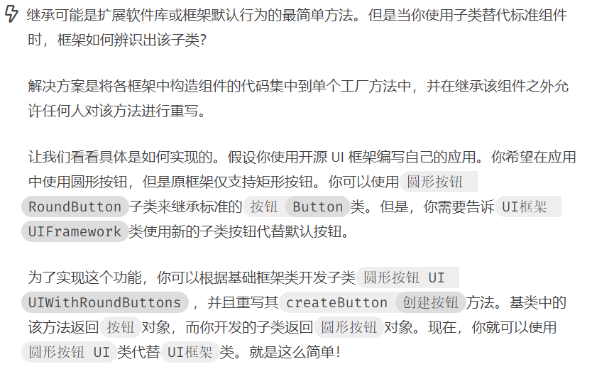
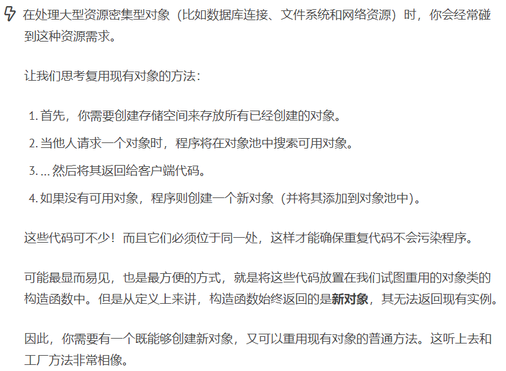
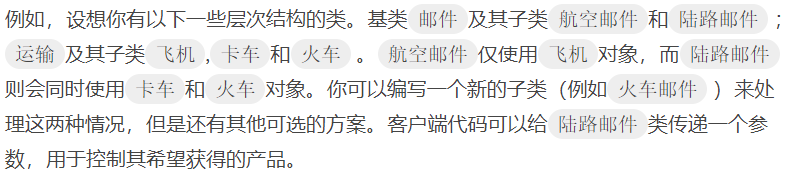

[TOC]

## Chapter 8 Factory Method (工厂方法)
> **对象创建模式**  
> 通过“对象创建” 模式绕开new，来避免对象创建（new）过程中所导致的紧耦合（依赖具体类），从而支持对象创建的稳定。它是接口抽象之后的第一步工作。  
> 典型模式  
> • **Factory Method**  
> • Abstract Factory  
> • Prototype  
> • Builder  


### 8.1 Motivation
* 在软件系统中，经常面临着创建对象的工作；由于需求的变化，需要创建的对象的具体类型经常变化。  
  <br>  
* 如何应对这种变化？如何绕过常规的对象创建方法(new)，提供一种“封装机制”来避免客户程序和这种“具体对象创建工作”的 紧耦合？  

### 8.2 Definition
> 定义一个用于创建对象的接口，让子类决定实例化哪一个类。Factory Method使得一个类的实例化延迟（目的：解耦，手段：虚函数）到子类。  ——《设计模式》 GoF

### 8.3 Structure  
  

### 8.4 Course points  
* **Factory Method模式用于隔离类对象的使用者和具体类型之间的耦合关系。面对一个经常变化的具体类型，紧耦合关系(new)会导致软件的脆弱。**  
<br>  

* **Factory Method模式通过面向对象的手法，将所要创建的具体对象工作延迟到子类，从而实现一种扩展（而非更改）的策略，较好地解决了这种紧耦合关系。**  
<br>  

* **Factory Method模式解决“单个对象”的需求变化。缺点在于要求创建方法/参数相同。**  

### 8.5 Application scenarios  
* **当你在编写代码的过程中，如果无法预知对象确切类别及其依赖关系时，可使用工厂方法**  
  * 工厂方法将创建产品的代码与实际使用产品的代码分离，从而能在不影响其他代码的情况下扩展产品创建部分代码。  
  * 例如，如果需要向应用中添加一种新产品，你只需要开发新的创建者子类，然后重写其工厂方法即可。  
  <br>
* **如果你希望用户能扩展你软件库或框架的内部组件，可使用工厂方法**  
  
  <br>  

* **如果你希望复用现有对象来节省系统资源，而不是每次都重新创建对象，可使用工厂方法**  
   

### 8.6 Implements Way  
* 让所有产品都遵循同一接口。该接口必须声明对所有产品都有意义的方法。  
  <br>
* 在创建类中添加一个空的工厂方法。该方法的返回类型必须遵循通用的产品接口。  
  <br>  
* 在创建者代码中找到对于产品构造函数的所有引用。将它们依次替换为对于工厂方法的调用， 同时将创建产品的代码移入工厂方法。你可能需要在工厂方法中添加临时参数来控制返回的产品类型。  
  <br>  
* 现在，为工厂方法中的每种产品编写一个创建者子类，然后在子类中重写工厂方法，并将基本方法中的相关创建代码移动到工厂方法中。  
  <br>  
* 如果应用中的产品类型太多， 那么为每个产品创建子类并无太大必要， 这时你也可以在子类中复用基类中的控制参数。  
      
  <br>  
* 如果代码经过上述移动后，基础工厂方法中已经没有任何代码，你可以将其转变为抽象类。如果基础工厂方法中还有其他语句，你可以将其设置为该方法的默认行为。  

### 8.7 Advantages and Disadvantages  
#### 8.7.1 Advantages
* 你可以避免创建者和具体产品之间的紧密耦合。  
  <br>  
* 单一职责原则。你可以将产品创建代码放在程序的单一位置，从而使得代码更容易维护。  
  <br>  
* 开闭原则。无需更改现有客户端代码，你就可以在程序中引入新的产品类型。  
  <br>  
#### 8.7.2 Disadvantages  
* 应用工厂方法模式需要引入许多新的子类，代码可能会因此变得更复杂。最好的情况是将该模式引入创建者类的现有层次结构中。

### 8.8 Relationship with other Patterns  
* 在许多设计工作的初期都会使用**工厂方法模式**（较为简单，而且可以更方便地通过子类进行定制），随后演化为使用**抽象工厂模式、原型模式或生成器模式**（更灵活但更加复杂）。  
  <br>  
* **抽象工厂模式**通常基于一组工厂方法，但你也可以使用**原型模式**来生成这些类的方法。  
  <br>  
* 你可以同时使用**工厂方法**和**迭代器模式**来让子类集合返回不同类型的迭代器，并使得迭代器与集合相匹配。  
  <br>  
* **原型模式**并不基于继承，因此没有继承的缺点。另一方面， 原型模式需要对被复制对象进行复杂的初始化。工厂方法基于继承，但是它不需要初始化步骤。  
  <br>  
* **工厂方法**是**模板方法**模式的一种特殊形式。同时，工厂方法可以作为一个大型模板方法中的一个步骤。  
  
### 8.9 Example
#### 8.9.1 案例描述  
> 在MainForm 主窗口中定义一个监听buttonClick的方法，当用户点击按钮时，会触发文件分割操作。但是文件分割有BinarySplitter、TxtSplitter、PictureSplitter、VideoSplitter 等很多种，我们如何设计方案，实现对象的使用者和具体类型之间松耦合呢？


> 为了更加突出Factory Method 的思想，我参考 《Head First Design Patterns》 等资料对课上老师给出的代码进行了修改。


#### 8.9.2 before  

* 使用接口定义ISplitter是好的想法，但是在buttonClick() 中，**new BinarySplitter()**等是一种编译时依赖，和具体类型相关，是紧耦合的，这不符合我们的“**依赖倒置原则**”（不应该依赖实现细节）。当出现新的文件分割方法时，必须修改这段代码（这种直接在原来代码段修改的方式不算扩展，而是修改）,MainForm应该是稳定的，支持扩展不支持修改。 


* **注意：这里和Strategy 有些相似，都是由很多 if ... else 结构组成，但是这里突出的是很多 new 工作，而Strategy 不是。**  


```java
    // 定义一个公共的文件分割器接口
    public interface ISplitter {
        void split();
    }
    
    // 具体文件分割器（以BinarySplitter为例）
    class BinarySplitter implements ISplitter{
        @Override
        public void split() {
            // ...
        }
    }

    public class MainForm {

        // 这里是成员变量定义

        public void buttonClick(String type){
            ISplitter iSplitter = null;

            if(type.equals("BinarySplitter")){
                iSplitter =  new BinarySplitter();
            }
            else if(type.equals("TextSplitter")) {
                iSplitter =  new TextSplitter();
            }
            else if (type.equals("PictureSplitter")){
                iSplitter =  new PictureSplitter();
            }
            else if(type.equals("VideoSplitter")){
                iSplitter =  new VideoSplitter();
            }

            iSplitter.split();

            // ... 其他操作
        }
        // ... 其他操作
    }
```  

#### 8.9.3 after
* ISplitter 不需要改变，增加一个工厂方法接口，用于创建具体对象

```java
    // 工厂接口
    public interface SplitterFactory {
        ISplitter createSplitter(String type);
    }
```

* Concrete Factory （工厂接口具体实现类），**把原先在MainForm中new 的任务放到了新的接口实现类中，实现了解耦合**  

```java
    class FileSplitterFactory implements  SplitterFactory{
        @Override
        public ISplitter createSplitter(String type) {
            if(type.equals("BinarySplitter")){
                return new BinarySplitter();
            }
            else if(type.equals("TextSplitter")) {
                return new TextSplitter();
            }
            else if (type.equals("PictureSplitter")){
                return new PictureSplitter();
            }
            else if(type.equals("VideoSplitter")){
                return new VideoSplitter();
            }
            return null;
        }
    }
```

* MainFom 依赖ISplitter 和 SplitterFactory，这两个都是接口（抽象），是稳定的

```java
    public class MainForm {
        SplitterFactory factory;

        public MainForm(SplitterFactory factory) {
            this.factory = factory;
        }

        /**
         * 李建忠老师给的如下参考代码似乎有问题？
         * ISplitter iSplitter = factory.createSplitter()
         * 这并没有给出具体的splitter类型，这也是我对其代码进行更改的原因
         */
        public void buttonClick(String splitterType){
            ISplitter iSplitter = factory.createSplitter(splitterType);
        }
    }

```  


* 类 UML 图  
    > 最终结果是：MainFom 依赖ISplitter 和 SplitterFactory，这两个都是接口（抽象），是稳定的。
    > ISplitter 对应 Structure 里面的Product，SplitterFactory 对应 Creator
    > BinarySplitter、TextSplitter、PictureSplitter、VideoSplitter 对应ConcreteProduct
    > FileSplitterFactory 对应 ConcreteCreator

  

### 8.10 Reference  
* [Factory Method](https://refactoringguru.cn/design-patterns/factory-method)