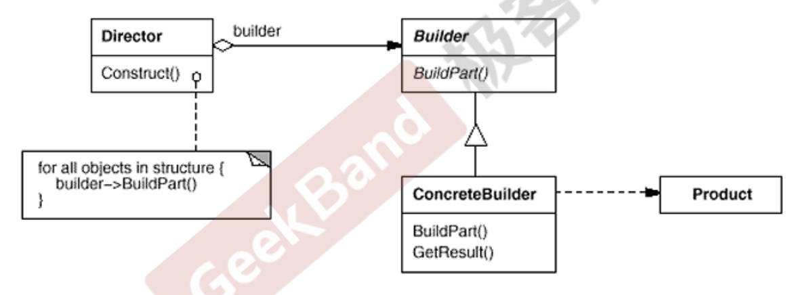
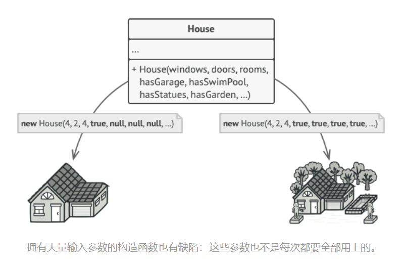
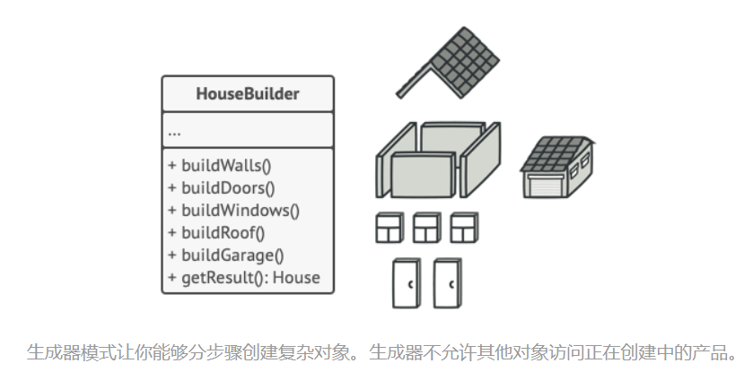
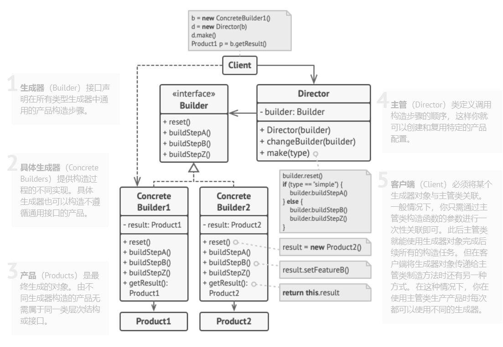
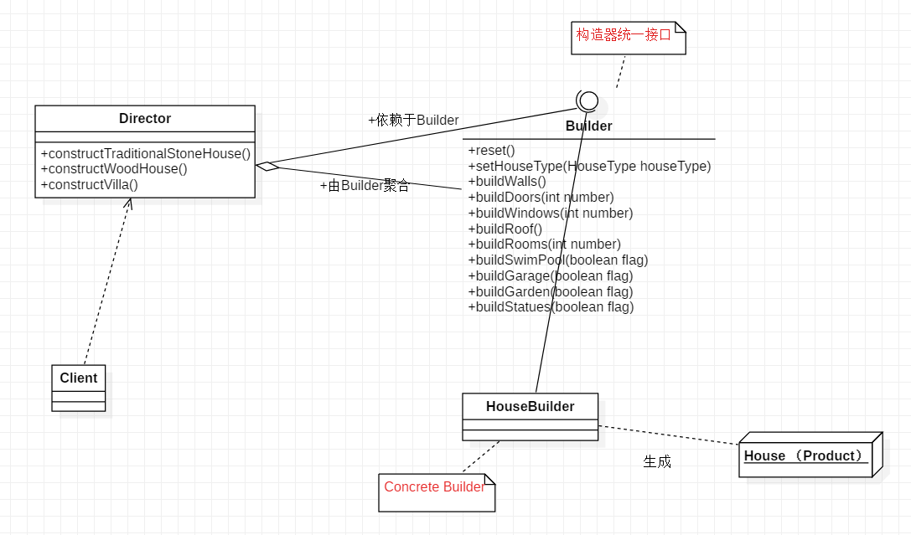

[TOC]

## Chapter 11 Builder
> **对象创建模式**  
> 通过“对象创建” 模式绕开new，来避免对象创建（new）过程中所导致的紧耦合（依赖具体类），从而支持对象创建的稳定。它是接口抽象之后的第一步工作。
> Prototype 相比较Factory Method 和 Abstract Factory 用的比较少    
> 典型模式    
> • Factory Method  
> • Abstract Factory  
> • Prototype  
> • **Builder**  

### 11.1 Motivation

* 在软件系统中，有时候面临着“一个复杂对象”的创建工作，其通常由各个部分的子对象用一定的算法构成；由于需求的变化，这个复杂对象的各个部分经常面临着剧烈的变化，但是将它们组合在一起的算法却相对稳定。

    <br>

* 如何应对这种变化？如何提供一种“封装机制”来隔离出“复杂对象的各个部分”的变化，从而保持系统中的“稳定构建算法”不随着需求改变而改变？

### 11.2 Definition
> **将一个复杂对象的构建与其表示相分离，使得同样的构建过程(稳定)可以创建不同的表示(变化)**。  ——《设计模式》 GoF


### 11.3 Structure  




### 11.4 Course points
* Builder 模式主要用于“分步骤构建一个复杂的对象”。在这其中“分步骤”是一个稳定的算法，而复杂对象的各个部分则经常变化。

<br>

* 变化点在哪里，封装哪里——Builder模式主要在于应对“复杂对象各个部分”的频繁需求变动。其缺点在于难以应对“分步骤构建算法”的需求变动。

* 在Builder模式中，要注意不同语言中构造器内调用虚函数的差别（C++ vs. C#) 。  


### 11.5 Example
#### 11.5.1 案例描述
> 我们来思考如何创建一个 房屋House对象。 建造一栋简单的房屋， 首先你需要建造四面墙和地板， 安装房门和一套窗户， 然后再建造一个屋顶。但是如果你想要一栋更宽敞更明亮的房屋， 还要有院子和其他设施 （例如暖气、 排水和供电设备）， 那又该怎么办呢？


#### 11.5.2 before
* 最简单的方法是扩展 房屋基类， 然后创建一系列涵盖所有参数组合的子类。 但最终你将面对相当数量的子类。 任何新增的参数 （例如门廊类型） 都会让这个层次结构更加复杂。

    <br>


* 另一种方法则无需生成子类。 你可以在 房屋基类中创建一个包括所有可能参数的超级构造函数， 并用它来控制房屋对象。 这种方法确实可以避免生成子类， 但它却会造成另外一个问题。 

 


#### 11.5.3 after
* 生成器模式建议将对象构造代码从产品类中抽取出来， 并将其放在一个名为生成器的独立对象中。  




* 该模式会将对象构造过程划分为一组步骤， 比如 build­Walls创建墙壁和 build­Door创建房门创建房门等。 每次创建对象时， 你都需要通过生成器对象执行一系列步骤。 重点在于**你无需调用所有步骤， 而只需调用创建特定对象配置所需的那些步骤即可**。

    <br>

* 例如， 假设第一个建造者使用木头和玻璃制造房屋， 第二个建造者使用石头和钢铁， 而第三个建造者使用黄金和钻石。 在调用同一组步骤后， 第一个建造者会给你一栋普通房屋， 第二个会给你一座小城堡， 而第三个则会给你一座宫殿。
* 
    <br>

* 你可以进一步将用于创建产品的一系列生成器步骤调用抽取成为单独的主管类。 主管类可定义创建步骤的执行顺序， 而生成器则提供这些步骤的实现。

    <br>

* 严格来说， 你的程序中并不一定需要主管类。 客户端代码可直接以特定顺序调用创建步骤。 不过， 主管类中非常适合放入各种例行构造流程， 以便在程序中反复使用。此外， 对于客户端代码来说， 主管类完全隐藏了产品构造细节。 客户端只需要将一个生成器与主管类关联， 然后使用主管类来构造产品， 就能从生成器处获得构造结果了。


<br>


* 参考模式架构  

 

* 定义实体类

```java
    public class House {
        private  HouseType houseType; // 原材料类型
        private  int windows;
        private  int doors;
        private  int rooms;
        private boolean hasSwimPool;
        private boolean hasGarage;
        private boolean hasGarden;
        private boolean hasStatues;

        // 不定义含参构造函数，具体House 类型由 Builder 通过 setter 设置
        public House() {

        }

        // getter...
        // setter...
    }
```

* 定义构造器接口

```java
    public interface Builder {
        void reset();
        void setHouseType(HouseType houseType);
        void buildWalls();
        void buildDoors(int number);
        void buildWindows(int number);
        void buildRoof(); // 房顶
        void buildRooms(int number);

        void buildSwimPool(boolean flag); // 是否建游泳池
        void buildGarage(boolean flag); // 是否建车库
        void buildGarden(boolean flag); // 是否建花园
        void buildStatues(boolean flag); // 是否建雕塑
    }
```

* Concrete Builder （具体的构造器）
```java
    public class HouseBuilder implements Builder{
        private House newHouse;

        @Override
        public void reset() {
            newHouse = new House(); // 初始化一个全新的空白对象，builder 对其进行构造
        }

        @Override
        public void setHouseType(HouseType houseType) {
            newHouse.setHouseType(houseType);
        }

        @Override
        public void buildWalls() {
            // ...
        }

        // 返回建造好的房子 (Product)，一般写在 Builder 中 而不是 Director
        public House getProduct(){
            return newHouse;
        }

        // 省略的其他方法 ...

    }
```

* 主管控制生产器  

```java
    public class Director {

        // 建造一个传统的石头房子
        public void constructTraditionalStoneHouse(Builder builder){
            builder.reset();
            builder.setHouseType(HouseType.STONE_HOUSE);
            builder.buildWalls();
            builder.buildDoors(4);
            builder.buildWindows(8);
            builder.buildRooms(5);
            builder.buildRoof();
        }

        // .. 其他类型房子构造方法
    }
```

* 客户端通过Director调用构造器构造房子，构造器返回房子

```java
    public class Client {
        public static void main(String[] args) {

            Director director = new Director();

            HouseBuilder builder = new HouseBuilder();

            director.constructTraditionalStoneHouse(builder); // 主管中自定义的模板方法，可复用

            House traditionalStoneHouse = builder.getProduct();
            System.out.println(traditionalStoneHouse);
        }
    }
```

* 类 UML 图  

       

* 至此，我们实现了复杂对象的构建（HouseBuilder）和其表示（House）的分离。目前仍可能存在的问题及其处理思路：

    <br>


  * 如果需要增加新的House属性，那么就需要修改 House 类，这里可以通过抽象House 基类进行扩展的办法解决

    <br> 


  * 如果需要增加新的构造方法，如增加建造排水系统方法 buildDrain()，此时可通过扩展 Builder，定义新的方法来实现。

### 11.6 Reference  

* [生产器模式](https://refactoringguru.cn/design-patterns/builder)