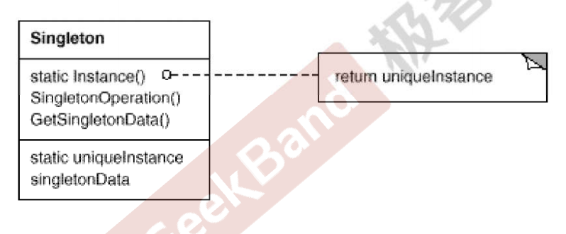
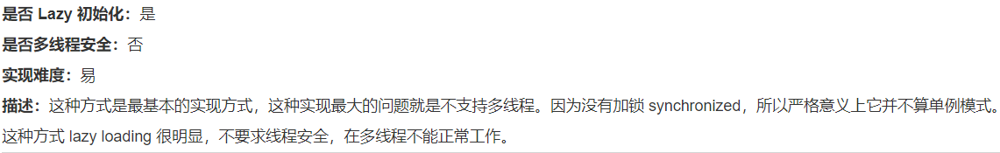
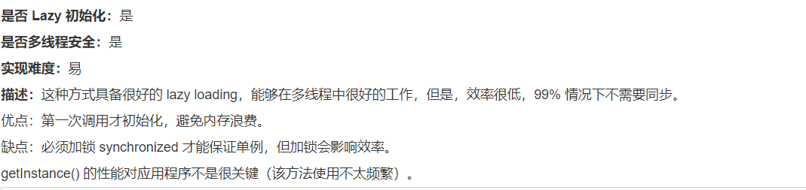
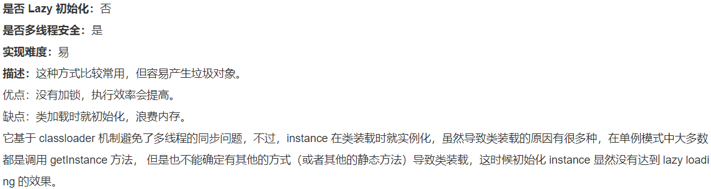
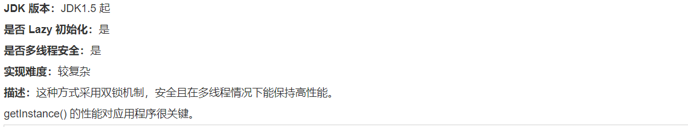
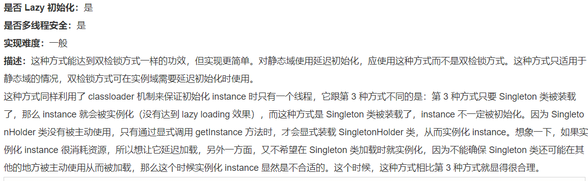
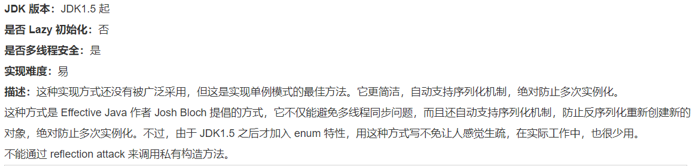

[TOC]

## Chapter 12 Singleton
> **对象性能模式**  
> 面向对象很好的解决了“抽象”的问题，但是不可避免地要付出一定的代价。对于通常情况来说，面向对象的成本大都可以忽略不计。但是在某些情况，面向对象所带来的成本必须谨慎处理。
> 典型模式    
> • **Singleton**  
> • Flyweight  

### 10.1 Motivation
* 在软件系统中，经常有这样一些特殊的类，必须保证它们在系统中只存在一个实例，才能确保他们的逻辑正确性、以及良好的效率。

    <br>

* 如何绕过常规的构造器，提供一种机制来保证一个类只有一个实例？

    <br>

* 这应该是类设计者的责任，而不是使用者的责任。

### 10.2 Definition
>**保证一个类仅有一个实例，并且提供一个该实例的全局访问点**。 ——《设计模式》GoF

### 10.3 Structure  


### 10.4 Course points

* Singleton 模式中的实例构造器可以设置为protected以允许子类派生。

    <br>

* Singleton 模式一般不支持Clone,因为这有可能导致多个对象实例，与 Singleton 模式的初衷违背。

    <br>

* 如何实现多线程环境下安全的 Singleton ?

### 10.5 Singleton 的几种实现方式
#### 10.5.1 懒汉式，线程不安全
    


```java
    public class Singleton {  
        private static Singleton instance;  
        private Singleton (){}  //显示定义私有构造函数
    
        public static Singleton getInstance() {  

            if (instance == null) {  
                instance = new Singleton();  
            }  

            return instance;  
        }  
    }
```

#### 10.5.2 懒汉式、线程安全


```java
    public class Singleton {  
        private static Singleton instance;  

        private Singleton (){} //显示定义私有构造函数  

        public static synchronized Singleton getInstance() {  

            if (instance == null) {  
                instance = new Singleton();  
            }  

            return instance;  
        }  
    }
```
#### 10.5.3 饿汉式、线程安全

```java
    public class Singleton {  
        private static Singleton instance = new Singleton();  

        private Singleton (){}  //显示定义私有构造函数

        public static Singleton getInstance() {  
            return instance;  
        }  
    }
```
#### 10.5.4 双检锁/双重校验锁（DCL，即 double-checked locking）


* **这种方法必须 使用 volatile 关键字，保证对象创建过程指令不会 reorder**
```java
    public class Singleton {  
        private volatile static Singleton singleton;  // 必须使用 volatile 关键字

        private Singleton (){}  //显示定义私有构造函数

        public static Singleton getSingleton() {  
            if (singleton == null) {  

                synchronized (Singleton.class) {  

                    if (singleton == null) {  
                        singleton = new Singleton();  
                    }  

                }  

            }  
            return singleton;  
        }  
    }
```

#### 10.5.5 登记式/静态内部类

```java
    public class Singleton {  
        private static class SingletonHolder {  
            private static final Singleton INSTANCE = new Singleton();  
        }  

        private Singleton (){} //显示定义私有构造函数

        public static final Singleton getInstance() {  
            return SingletonHolder.INSTANCE;  
        }  
    }
```

#### 10.5.6 枚举


```java
    public enum Singleton {  
        INSTANCE;  

        public void whateverMethod() {  

        }  
    }
```

### 10.6 Reference

* [Java sychronized 关键字详解](https://www.cnblogs.com/gnagwang/archive/2011/02/27/1966606.html)
* [Java sychronized 关键字](https://www.jackforfun.com/java-synchronized)
* [为什么volatile可以一定程度上保证双检锁ok？](https://blog.csdn.net/Null_RuzZ/article/details/72530826)
* [菜鸟教程：Java Singleton](https://www.runoob.com/design-pattern/singleton-pattern.html) 