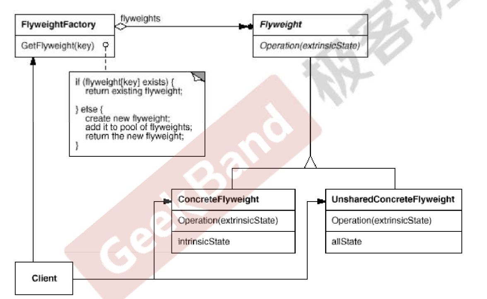
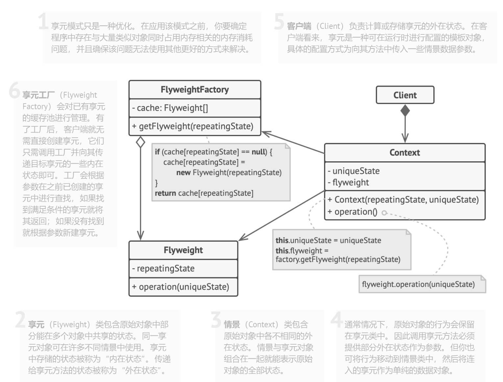
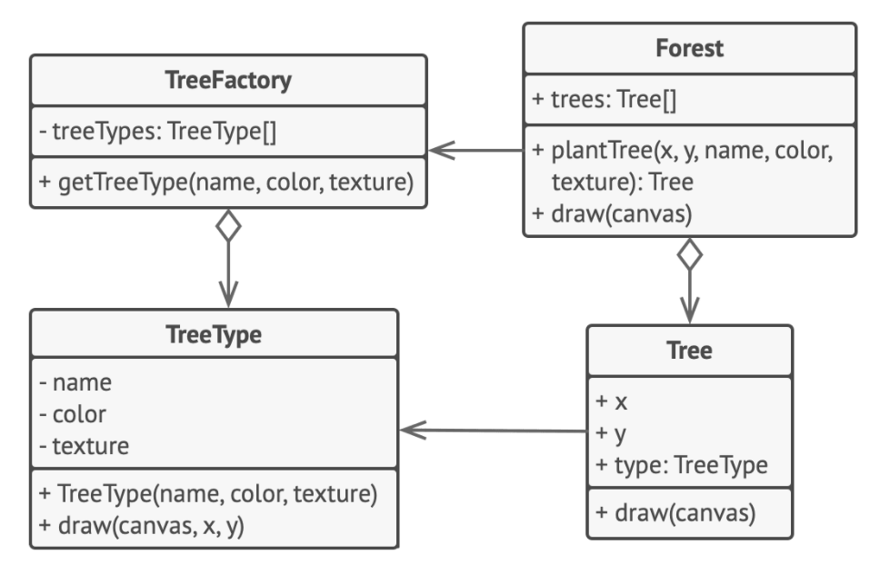

[TOC]

## Chapter 13 Flyweight
> **对象性能模式**  
> 面向对象很好的解决了“抽象”的问题，但是不可避免地要付出一定的代价。对于通常情况来说，面向对象的成本大都可以忽略不计。但是在某些情况，面向对象所带来的成本必须谨慎处理。
> 典型模式    
> • Singleton
> • **Flyweight**  

### 10.1 Motivation
* 在软件系统采用纯粹对象方案的问题在于大量细粒度的对象会很快充斥在系统中，从而带来很高的运行时代价——主要指内存需求方面的代价。

    <br>

* 如何在避免大量细粒度对象问题的同时，让外部客户程序仍然能狗透明地使用面向对象的方式来进行操作？

### 10.2 Definition
> 运用共享技术有效地支持大量细粒度的对象。——《设计模式》GoF

### 10.3 Structure  



### 10.4 Course points
* 面向对象很好地解决了抽象性的问题，但是作为一个运行在机器中的程序实体，我们需要考虑对象的代价问题。**Flyweight 主要解决面向对象的代价问题，一般不触及面向对象的抽象性问题。**


 <br>

* Flyweight 采用对象共享的做法来降低系统中对象的个数，从而降低细粒度对象给系统带来的内存压力。在具体实现方面，**要注意对象状态的处理**（只读）。


    <br>

* 对象的数量太大从而导致对象的内存开销加大——什么样的数量才算大？这需要我们仔细的根据具体应用情况进行评估，而不能凭空臆断。

### 10.5 Implements way
* 将需要改写为享元的类成员变量拆分为两个部分：
  * 内在状态：包含不变的、 可在许多对象中重复使用的数据的成员变量。
  * 外在状态： 包含每个对象各自不同的情景数据的成员变量

    <br>

* **保留类中表示内在状态的成员变量， 并将其属性设置为不可修改**。 这些变量仅可在构造函数中获得初始数值。

    <br>

* 找到所有使用外在状态成员变量的方法， 为在方法中所用的每个成员变量新建一个参数， 并使用该参数代替成员变量。

    <br>

* 你可以有选择地创建工厂类来管理享元缓存池， 它负责在新建享元时检查已有的享元。 如果选择使用工厂， 客户端就只能通过工厂来请求享元， 它们需要将享元的内在状态作为参数传递给工厂。

    <br>

* 客户端必须存储和计算外在状态 （情景） 的数值， 因为只有这样才能调用享元对象的方法。 为了使用方便， 外在状态和引用享元的成员变量可以移动到单独的情景类中。 


### 10.6 Advantages and disadvantages
* 如果程序中有很多相似对象， 那么你将可以节省大量内存。

    <br>
    
* 你可能需要牺牲执行速度来换取内存， 因为他人每次调用享元方法时都需要重新计算部分情景数据

    <br>

* 代码会变得更加复杂。 团队中的新成员总是会问： ​ “为什么要像这样拆分一个实体的状态？”。

### 10.7 Example1
* 案例描述
    > 视频中老师给出的案例：一篇文章中有很多字符（Character），如果每个字符都定义为一个对象，具体地，都包括字符内容（char c）和使用的字体Font（占用内存很大，假设为为1K），如果文章有1000000个字符，那么将占用 1000000 *（1K + 1B）内存。但是，事实上，一篇文章只会使用很少类型的Font。如何解决这个问题呢？

    <br>

* 如何实现 Font 复用？
  > 可以把 Font 和 具体字符 分离开，把Font 定义为享元对象，实现复用

* 定义享元对象
    ```java
       /**
        * Font 对应模式中的 Flyweight 享元对象
        */
        public class Font {
            //unique object key (unique state)
            private String name;

            //object state read-only
            //....

            public Font(String name) {
                this.name = name;
            }

            // 享元对象的方法
            public void write(){
                // ..
            }
        }
    ```
* 定义情景对象 
    ```java
      /**
        * Character 为字符情景对象，它具体包括使用的字体类型和像素位置(x,y)
        * 情景对象包含状态的外在部分（字符 c）。程序中可以创建数十亿个此类对象，因为它们
        * 体积很小（字符一般占 1 B）：仅有两个整型坐标和一个引用成员变量（引用享元对象 Font）。
        */

        public class Character {
            private char c;
            private Font font; //存储 Font 引用（占用内存大小固定，和平台有关，如32位系统占用32位）

            public Character(char c,Font font) {
                this.c = c;
                this.font = font;
            }

            public void write(){
                // use current font to write c;
            }
        }
    ```

    <br>

* 定义享元工厂
    ```java
        /**
        * 享元工厂决定是否复用已有享元或者创建一个新的对象
        */
        public class FontFactory {
            private static Map<String,Font> fontPool = new HashMap<>();

            public static Font getFont(final String key){
                if(fontPool.get(key) != null){
                    return fontPool.get(key);
                }
                else{
                    Font font = new Font(key);
                    fontPool.put(key,font);
                    return font;
                }
            }

            public static void clear(){
                // ...
            }
        }
    ```
    <br>

* Client 
    ```java
    /**
        * 对情景对象操作，和使用享元对象之前使用原始对象的业务逻辑一致
        * 只是现在操作的是新定义的情景对象
        */
        public class Client {
            private List<Character> characters = new ArrayList<>();

            // 客户端添加情景对象
            public void addCharacter(char c, String name){
                Font font = FontFactory.getFont(name);
                characters.add(new Character(c,font));

            }

            // 客户端具体逻辑
            public void print(){
                for(Character character : characters){
                    character.write();
                }
            }
        }
    ```
    <br>
### 10.8 Example2
#### 10.8.1 案例描述
> 本例中，我们将渲染一片森林（1,000,000 棵树）！每棵树都由包含一些状态的对象来表示（坐标和纹理等）。尽管程序能够完成其主要工作，但很显然它需要消耗大量内存。原因很简单：太多树对象包含重复数据 （名称、纹理和颜色）。因此我们可用享元模式来将这些数值存储在单独的享元对象中（Tree­Type类）。现在我们不再将相同数据存储在数千个 Tree对象中，而是使用一组特殊的数值来引用其中一个享元对象。  

#### 10.8.2 实现过程(对应代码的after部分)
* **享元与不可变性**
  > 由于享元对象可在不同的情景中使用， 你必须确保其状态不能被修改。 享元类的状态只能由构造函数的参数进行一次性初始化， 它不能对其他对象公开其设置器或公有成员变量。   

    <br>

* **享元工厂**
  > 为了能更方便地访问各种享元， 你可以创建一个工厂方法来管理已有享元对象的缓存池。 工厂方法从客户端处接收目标享元对象的内在状态作为参数， 如果它能在缓存池中找到所需享元， 则将其返回给客户端； 如果没有找到， 它就会新建一个享元， 并将其添加到缓存池中。
    <br>

* **结构图**

    

    <br>
    
* 定义享元对象（对应原始对象的内部状态）
    ```java
        public class TreeType {
            private String name;
            private Color color;
            private String otherTreeData;

            public TreeType(String name, Color color, String otherTreeData) {
                this.name = name;
                this.color = color;
                this.otherTreeData = otherTreeData;
            }

            public void draw(Graphics g, int x, int y) {
                // ...
            }
        }
    ```
    <br>

* 定义情景对象（对应原始对象的外部状态，同时包含对内部状态，即享元对象的引用）
    ```java
      /**
        * Tree为情景对象,情景对象包含状态的外在部分（x,y）。程序中可以创建数十亿个此类对象，因为它们
        * 体积很小：仅有两个整型坐标和一个引用成员变量（引用享元对象 TreeType）
        */

        public class Tree {
            private int x;
            private int y;
            private TreeType type; // 对享元对象的引用，而不是完全存储享元的所有信息在Tree里面，从而实现复用（共享）

            public Tree(int x, int y, TreeType type) {
                this.x = x;
                this.y = y;
                this.type = type;
            }

            public void draw(Graphics g) {
                type.draw(g, x, y);
            }
        }
    ```
    <br>

* 定义享元工厂

    ```java
        /**
        * 享元工厂决定是否复用已有享元或者创建一个新的对象
        */
        public class TreeFactory {
            static Map<String, TreeType> treeTypes = new HashMap<>(); // 享元对象 Pool

            public static TreeType getTreeType(String name, Color color, String otherTreeData) {
                // Tree.name 确定 color 和 otherTreeData
                TreeType result = treeTypes.get(name);

                if (result == null) {
                    result = new TreeType(name, color, otherTreeData);
                    treeTypes.put(name, result);
                }

                return result;
            }
        }
    ```
    <br>

* Client 创建无数个情景对象
    ```java
        /**
        * Forest 是享元 客户端
        */
        public class Forest extends JFrame {
            private List<Tree> trees = new ArrayList<>();

            // 添加需要的情景对象
            public void plantTree(int x, int y, String name, Color color, String otherTreeData) {
                TreeType type = TreeFactory.getTreeType(name, color, otherTreeData);
                Tree tree = new Tree(x, y, type);
                trees.add(tree);
            }

            @Override
            public void paint(Graphics graphics) {
                for (Tree tree : trees) {
                    tree.draw(graphics);
                }
            }
        }

    ```
    <br>

* 类 UML 图

    


### 10.9 Reference
* [Flyweight:Tree](https://refactoringguru.cn/design-patterns/flyweight)