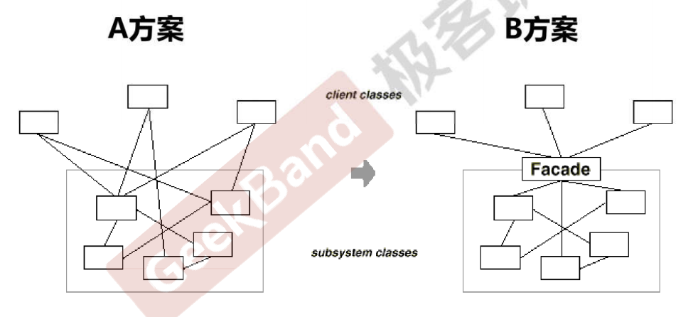
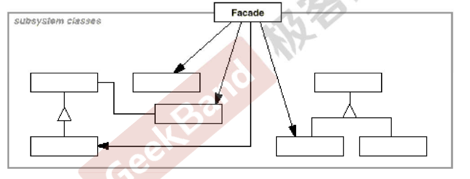
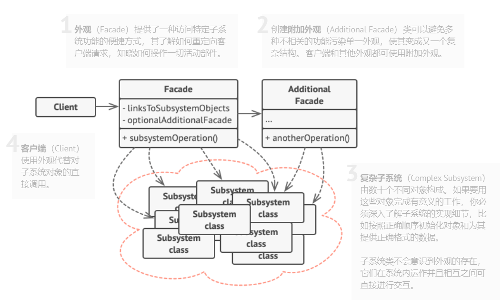
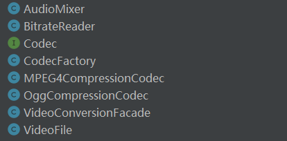
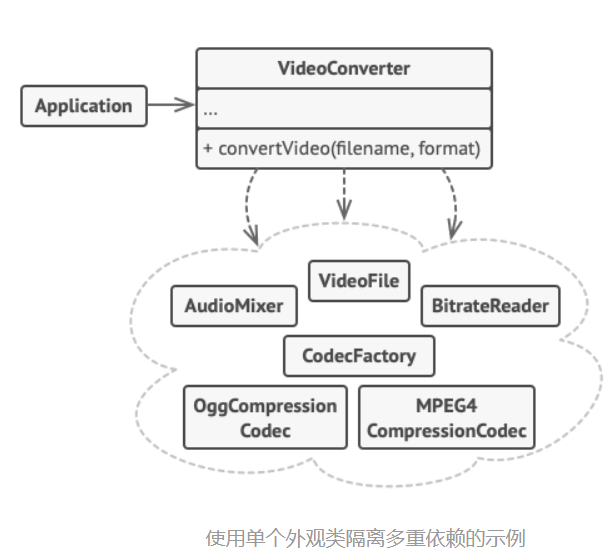

[TOC]

## Chapter 14 Facade（门面模式、外观模式）
> **接口隔离模式**   
> 在组件构建过程中，某些接口之间直接的依赖常常会带来很多问题、甚至根本无法实现。采用添加一层**间接**（稳定）接口，来隔离本来互相紧密关联的接口是一种常见的解决方案。   
> 典型模式   
> • **Facade**   
> • Proxy   
> • Adapter   
> • Mediator

### 14.1 Motivation  
   

* A 方案的问题在于组件的客户和组件中各种复杂的子系统有了过多的耦合，随着外部客户程序和各子系统的演化，这种过多的耦合面临很多变化的挑战。
    <br>
* 如何简化外部客户程序和系统间的交互接口？如何将外部客户程序的演化和内部子系统的变化之间的依赖相互解耦？

### 14.2 Definition
> 为子系统中的一组接口提供一个一致（稳定）的界面，Facade模式定义了一个高层接口，这个接口使得着这一系列子系统更加容易使用（复用）。  ——《设计模式》 GoF   

### 14.3 Structure  
* 《设计模式》——GoF
  

* From Reference 


### 14.4 Course points
* 从客户程序的角度来看，Facade 模式简化了整个组件系统的接口，对于组件内部与外部客户程序来说，达到了一种“解耦“的效果——内部子系统的任何变化不会影响到Facade 接口的变化。  
    <br>    
* Facade 设计模式更注重从架构的层次去看整个系统，而不是单个类的层次。Facade 很多时候更是一种架构设计模式。
    <br>   
* Facade 设计模式并非一个集装箱，可以任意地放进任何多个对象。Facade 模式中组件的内部应该是”相互耦合关系比较大的一系列组件“，而不是一个简单的功能集合。
    <br>   
* Facade 设计模式体现的是一种设计原则和思想的表达，没有固定的代码结构。

### 14.5 Implements Way
* 考虑能否在现有子系统的基础上提供一个更简单的接口。**如果该接口能让客户端代码独立于众多子系统类， 那么你的方向就是正确的**。
    <br>
* 在一个新的外观类中声明并实现该接口。**外观应将客户端代码的调用重定向到子系统中的相应对象处**。如果客户端代码没有对子系统进行初始化，也没有对其后续生命周期进行管理， 那么外观必须完成此类工作。  
    <br>
* 如果要充分发挥这一模式的优势，你必须确保所有客户端代码仅通过外观来与子系统进行交互。此后客户端代码将不会受到任何由子系统代码修改而造成的影响，比如子系统升级后，你只需修改外观中的代码即可。
    <br>
* 如果外观变得过于臃肿，你可以考虑将其部分行为抽取为一个新的专用外观类。

### 14.6 Advantages ans Disadvantages
* 你可以让自己的代码独立于复杂子系统。
    <br> 
* ~~外观可能成为与程序中所有类都耦合的上帝对象。~~

### 14.7 Relationship with other Patterns 
* **外观模式**为现有对象定义了一个新接口，**适配器模式**则会试图运用已有的接口。适配器通常只封装一个对象，外观通常会作用于整个对象子系统上。     
    <br>  
* 当只需对客户端代码隐藏子系统创建对象的方式时， 你可以使用**抽象工厂模式**来代替**外观模式**。  
    <br>
* **享元模式**展示了如何生成大量的小型对象，**外观模式**则展示了如何用一个对象来代表整个子系统。  
    <br>
* **外观模式**和**中介者模式**的职责类似： 它们都尝试在大量紧密耦合的类中组织起合作。
    <br>
  * 外观为子系统中的所有对象定义了一个简单接口，但是它不提供任何新功能。子系统本身不会意识到外观的存在。**子系统中的对象可以直接进行交流**。
    <br>
  * 中介者将系统中组件的沟通行为中心化。各组件只知道中介者对象，**无法直接相互交流**。
    <br>
* **外观类通常可以转换为单例模式类**，因为在大部分情况下一个外观对象就足够了。  
    <br>
* **外观模式**与**代理模式**的相似之处在于它们都缓存了一个复杂实体并自行对其进行初始化。代理与其服务对象遵循同一接口，使得自己和服务对象可以互换，在这一点上它与外观不同。
    <br>


### 14.8 Example  
#### 14.8.1 案例描述
> 复杂视频转换库的简单接口，在本例中，外观简化了复杂视频转换框架所进行的沟通工作。外观提供了仅包含一个方法的类， 可用于处理对框架中所需类的配置与以正确格式获取结果的复杂工作。
#### 14.8.2 after 
* Facade 类似架构模式，其实现方式多样，本例简单的给出一种实现方式   
    <br>   
* 类图   

      
    <br>

* 子系统内部相互联系的类  
    <br>
    ```java
        // 这里有复杂第三方视频转换框架中的一些类。我们不知晓其中的代码，因此无法
        // 对其进行简化。

        class VideoFile
        // ...

        class OggCompressionCodec
        // ...

        class MPEG4CompressionCodec
        // ...

        class CodecFactory
        // ...

        class BitrateReader
        // ...

        class AudioMixer
        // ...
    ```
* 为了将框架的复杂性隐藏在一个简单接口背后，我们创建了一个外观类。它是在功能性和简洁性之间做出的权衡。  
    <br> 
    ```java
        /**
         * Facade 内部实现被隐藏,对客户端提供 统一的 convertVideo 接口
         * 如果需要修改功能，只需修改convertVideo 内部实现，而对客户端来说，并没有任何影响
         */
        public class VideoConversionFacade {

            public File convertVideo(String fileName, String format) {
                System.out.println("VideoConversionFacade: conversion started.");
                VideoFile file = new VideoFile(fileName);
                // 获取sourceCodec
                Codec sourceCodec = CodecFactory.getCodec(file.getCodecType());
                // target Codec
                Codec destinationCodec = CodecFactory.getCodec(format);

                VideoFile buffer = BitrateReader.read(file, sourceCodec);

                VideoFile intermediateResult = BitrateReader.convert(buffer, destinationCodec);

                File result = (new AudioMixer()).fix(intermediateResult);

                System.out.println("VideoConversionFacade: conversion completed.");

                return result;
            }
        }
    ```
* 在本例中，外观模式简化了客户端与复杂视频转换框架之间的交互。对客户端提供了一致性接口（convertVideo）
    <br>
* 当然，在本例中对Codec创建过程中使用了Factory Method，但是这不是本章的主题，故不在赘述，可以自行参考源码(after/)  

    


### 14.9 Reference
* [Facade](https://refactoringguru.cn/design-patterns/facade)