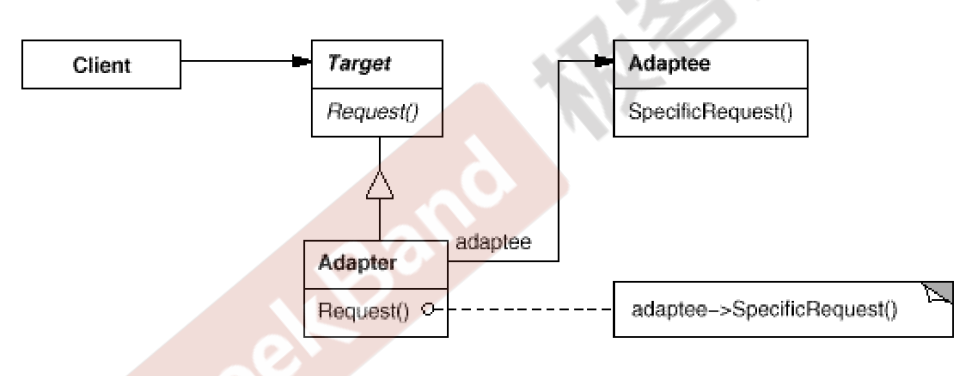
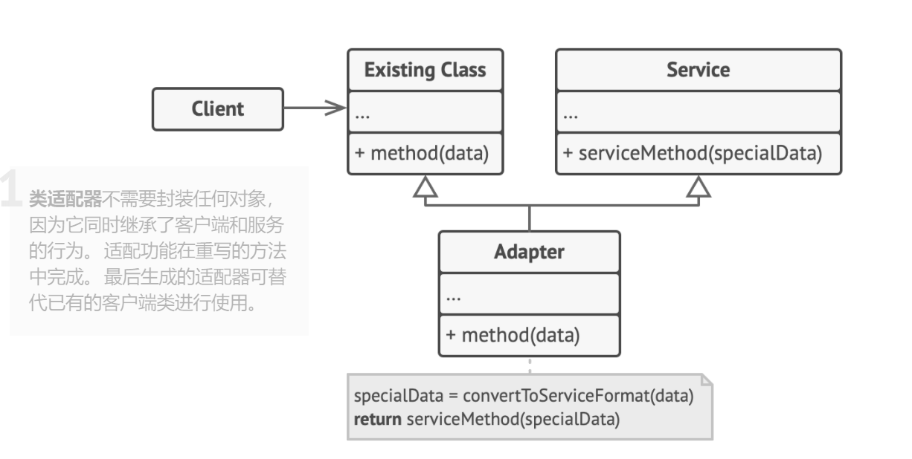
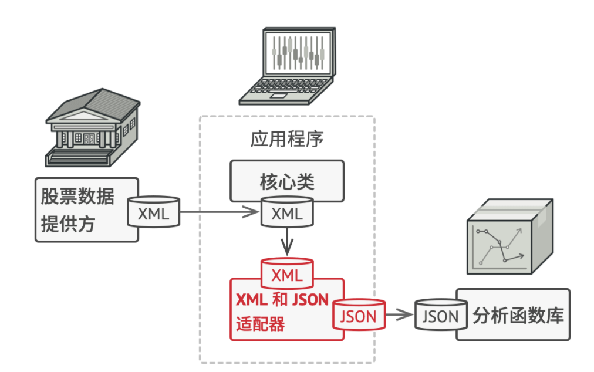
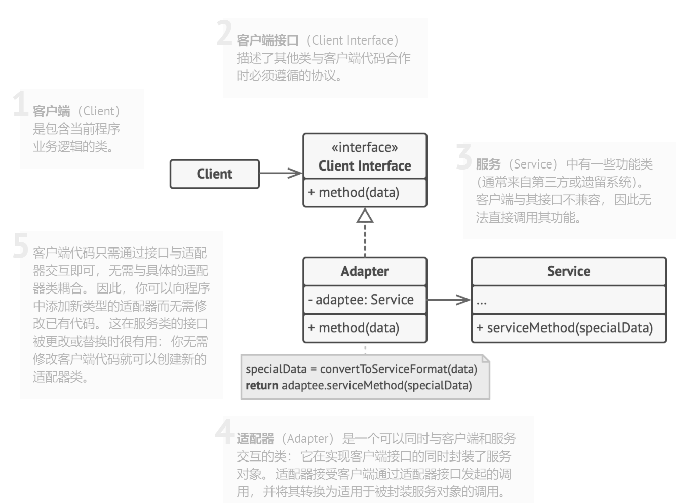

[TOC]

## Chapter 16 Adapter (适配器)
> **接口隔离模式**   
> 在组件构建过程中，某些接口之间直接的依赖常常会带来很多问题、甚至根本无法实现。采用添加一层**间接**（稳定）接口，来隔离本来互相紧密关联的接口是一种常见的解决方案。   
> 典型模式   
> • Facade   
> • Proxy   
> • **Adapter**   
> • Mediator   

### 16.1 Motivation   
* 在软件系统中，由于应用环境的变化，常常需要将“一些现存的对象”放在新的环境中应用，但是新环境要求的接口是这些现存对象所不满足的。  
  <br>  
* 如何应对这种“迁移的变化”？如何既能利用现有对象的良好实现，同时又能满足新的应用环境所要求的接口？

### 16.2 Definiton  
> 将一个类的接口转换成客户希望的另一个接口。Adapter模式使得原本由于接口不兼容而不能在一起工作的那些类可以一起工作。 ——《设计模式》 GoF  

### 16.3 Structure   
* 对象适配器  
    
    <br>  
* 类适配器 （不推荐使用）   
    
  
### 16.4 Course points  
* Adapter 模式主要应用于“希望复用一些现存的类，但是接口又与复用环境要求不一致的情况”，在遗留代码复用、类库迁移等方面非常有用。  
  <br>  
* GoF 23 定义了两种 Adapter 模式的实现结构：**对象适配器**和**类适配器**。但是类适配器采用“多继承”的实现方式，一般不推荐使用。**对象适配器采用“对象组合”的方式**，更符合松耦合精神。  
  <br>  
* Adapter 模式可以实现的非常灵活，不必拘泥于 GoF 23 中定义的两种结构。例如，完全可以将 Adapter 模式中的“现存对象”作为新的接口方法参数，来达到适配目的。  

### 16.5 Application scenarios  
* **当你希望使用某个类，但是其接口与其他代码不兼容时，可以使用适配器类**。  
  * 适配器模式允许你创建一个中间层类，其可作为代码与遗留类、第三方类或提供怪异接口的类之间的转换器。
  <br>  
* **如果您需要复用这样一些类，他们处于同一个继承体系，并且他们又有了额外的一些共同的方法，但是这些共同的方法不是所有在这一继承体系中的子类所具有的共性。**  
  * 将缺失功能添加到一个适配器类中是一种优雅得多的解决方案。然后你可以将缺少功能的对象封装在适配器中，从而动态地获取所需功能。如要这一点正常运作，**目标类必须要有通用接口，适配器的成员变量应当遵循该通用接口**。这种方式同装饰模式非常相似（Decorator 不仅 is-a 还有has-a关系，而 Adapter 只有 is-a关系，has的是待适配的类，其他类）。  

### 16.6 Implements Way  
* 确保至少有两个类的接口不兼容  
  * 一个无法修改（通常是第三方、遗留系统或者存在众多已有依赖的类）的功能性服务类。  
  * 一个或多个将受益于使用服务类的客户端类。  
  <br>  
* 声明客户端接口，描述客户端如何与服务交互。  
  <br>  
* 创建遵循客户端接口的适配器类。所有方法暂时都为空。  
  <br>  
* 在适配器类中添加一个成员变量用于保存对于服务对象的引用。通常情况下会通过构造函数对该成员变量进行初始化，但有时在调用其方法时将该变量传递给适配器会更方便。   
  <br>  
* 依次实现适配器类客户端接口的所有方法。适配器会将实际工作委派给服务对象，**自身只负责接口或数据格式的转换**。  
  <br>  
* 客户端必须通过客户端接口使用适配器。这样一来，你就可以在不影响客户端代码的情况下修改或扩展适配器。  

### 16.7 Advantages and Disadvantages  
#### 16.7.1 Advantages
* 单一职责原则，你可以将接口或数据转换代码从程序主要业务逻辑中分离。  
  <br>  
* 开闭原则。只要客户端代码通过客户端接口与适配器进行交互，你就能在不修改现有客户端代码的情况下在程序中添加新类型的适配器。  


#### 16.7.2 Disadvantages  
* 代码整体复杂度增加，因为你需要新增一系列接口和类。有时直接更改服务类使其与其他代码兼容会更简单。  

### 16.8 Relationship with other Patterns  
* **桥接模式**通常会于开发前期进行设计，使你能够将程序的各个部分独立开来以便开发。另一方面，**适配器模式**通常在已有程序中使用，让相互不兼容的类能很好地合作。  
  <br>  
* **适配器**可以对已有对象的接口进行修改，**装饰模式**则能在不改变对象接口的前提下**强化对象功能**。此外，**装饰还支持递归组合**，适配器则无法实现。  
  <br>  
* **适配器**能为被封装对象提供不同的接口，**代理模式**能为对象提供相同的接口，**装饰**则能为对象提供加强的接口。  
  <br>  
* **外观模式**为现有对象定义了一个新接口，**适配器**则会试图运用已有的接口。**适配器**通常只封装一个对象，**外观模式**通常会作用于整个对象子系统上。  
  <br>  
* **桥接、状态模式**和**策略模式**（在某种程度上包括适配器）模式的接口非常相似。实际上，**它们都基于组合模式——即将工作委派给其他对象**，不过也各自解决了不同的问题。模式并不只是以特定方式组织代码的配方，你还可以使用它们来和其他开发者讨论模式所解决的问题。  

### 16.9 Example 
#### 16.9.1 案例描述  
> 假如你**正在开发一款股票市场监测程序**（新接口），它会从不同来源下载 XML 格式的股票数据，然后向用户呈现出美观的图表。在开发过程中，你决定在程序中整合一个第三方智能分析函数库（需要兼容的接口，Adaptee）。但是遇到了一个问题，那就是分析函数库只兼容 JSON 格式的数据。  

#### 16.9.2 after 
* 你可以修改程序库来支持 XML。但是，这可能需要修改部分依赖该程序库的现有代码。甚至还有更糟糕的情况，你可能根本没有程序库的源代码，从而无法对其进行修改。  
  <br>  
* 为了解决数据格式不兼容的问题，你可以为分析函数库中的每个类创建将 XML 转换为 JSON 格式的适配器，然后让客户端仅通过这些适配器来与函数库进行交流。当某个适配器被调用时，它会将传入的 XML 数据转换为 JSON 结构，并将其传递给被封装分析对象的相应方法。  
  <br>  
  

* 新的接口  
  <br>  
  ```java 
    /**
      * 目前客户端调用的新接口
      */
      public interface ITarget {
          void showData(XMLData data);
      }
  ```
* 第三方接口（老接口） 
  <br>  
  ```java
    /**
      * 遗留类的接口（老接口）
      */
      public interface IAdaptee {
          void showDigram(JSONData data);
      }
  ```  
* 老接口的实现类（用于对 JSON 类型数据进行图表展示，第三方）  
  <br>  
  ```java
    /**
      * 遗留接口的实现类
      */
      public class JsonAnalysis implements IAdaptee{
          @Override
          public void showDigram(JSONData data) {
              // ... 用 JSONData 呈现图表
          }
      }

  ```  
* 定义适配器，兼容老接口  
  <br>  
  ```java
    /**
      * Adapter 实现对旧接口类型兼容:
      * 一般需要把新接口传过来的参数，在Adapter的实例方法中变成兼容老接
      * 口的参数类型(convertXML2Json : XMLData -> JSONData)
      * 然后调用老接口的实例化对象的旧方法(showDigram)，实现新旧兼容
      */
      public class Adapter implements ITarget{
          IAdaptee service; // 对旧的接口的引用

          public Adapter(IAdaptee service) {
              this.service = service;
          }

          // 转换XML数据为Json类型，以支持旧的接口
          public JSONData convertXML2Json(XMLData data){
              // ...
              return new JSONData(); // 假设已经成功转换
          }

          @Override
          public void showData(XMLData data) {
              // 先把新接口使用的数据类型转换为兼容老接口的数据类型（XMLData -> JSONData）
              JSONData jsonData = convertXML2Json(data);

              // 使用旧类的接口实例对象 service 调用旧类的方法
              service.showDigram(jsonData);
          }
      }
  ```
* 类 UML 图  
  

### 16.10 Reference
* [Adapter](https://refactoringguru.cn/design-patterns/adapter)