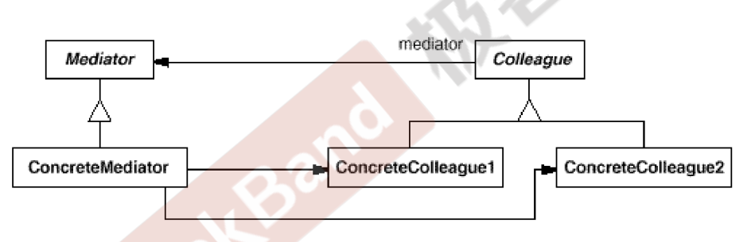

[TOC]

## Chapter 16 Adapter (适配器)
> **接口隔离模式**   
> 在组件构建过程中，某些接口之间直接的依赖常常会带来很多问题、甚至根本无法实现。采用添加一层**间接**（稳定）接口，来隔离本来互相紧密关联的接口是一种常见的解决方案。   
> 典型模式   
> • Facade   
> • Proxy   
> • Adapter   
> • **Mediator**    

### 16.1 Motivation  
* 在软件构建过程中，经常会出现多个对象互相关联交互的情况，对象之间经常会维持一种复杂的引用关系，如果遇到一些需求的更改，这种直接的引用关系将面临不断的变化。  
     
* 在这种情况下，我们可以使用一个“中介对象”来管理对象间的关联关系，避免相互交互的对象之间紧耦合引用关系，从而更好的抵御变化。  

### 16.2 Definition  
> 用一个中介对象来封装（封装变化）一系列的对象交互。中介者使各对象不需要显示的相互引用（编译时依赖 ==> 运行时依赖），从而使其耦合松散（管理变化），而且可以独立地改变它们之间的交互。——《设计模式》GoF  

### 16.3 Structure  

  

### 16.4 Course points  
* 将多个对象间复杂的关联关系解耦，Mediator 模式将多个对象间的控制逻辑进行集中管理，变 “**多个对象互相关联**” 为 “多个对象和一个中介者关联”，简化了系统的维护，抵御了可能的变化。  
     
* 随着控制逻辑的复杂化，Mediator 具体对象的实现可能相当复杂。这时候可以对 Mediator 对象进行分解处理。  
     
* **Facade 模式是解耦系统间（单向）的对象关联关系；Mediator 模式是解耦系统内各对象之间（双向）的关联关系。**  

### 16.5 Application scenarios  
* **当一些对象和其他对象紧密耦合以致难以对其进行修改时，可使用中介者模式**。  
  * 该模式让你将对象间的所有关系抽取成为一个单独的类，以使对于特定组件的修改工作独立于其他组件。  
     
* **当组件因过于依赖其他组件而无法在不同应用中复用时，可使用中介者模式**。  
  * 应用中介者模式后，每个组件不再知晓其他组件的情况。尽管这些组件无法直接交流，但它们仍可通过中介者对象进行间接交流。如果你希望在不同应用中复用一个组件，则需要为其提供一个新的中介者类(不同中介者处理不同的逻辑)。  
     
* **如果为了能在不同情景下复用一些基本行为，导致你需要被迫创建大量组件子类时，可使用中介者模式**。  
  * 由于所有组件间关系都被包含在中介者中，因此你**无需修改组件就能方便地新建中介者类以定义新的组件合作方式**。  

### 16.6 Implements way  
* 找到一组当前紧密耦合，且提供其独立性能带来更大好处的类（例如更易于维护或更方便复用）。  
     
* 声明中介者接口并描述中介者和各种组件之间所需的交流接口。在**绝大多数情况下，一个接收组件通知的方法就足够了**。如果你希望在不同情景下复用组件类，那么该接口将非常重要。只要组件使用通用接口与其中介者合作，你就能将该组件与不同实现中的中介者进行连接。  
     
* 实现具体中介者类。该类可从自行**保存其下所有组件**的引用中受益。  
     
* 你可以更进一步，让中介者负责组件对象的创建和销毁。此后，中介者可能会与工厂或外观类似。  
     
* **组件必须保存对于中介者对象的引用**。**该连接通常在组件的构造函数中建立，该函数会将中介者对象作为参数传递**。  
     
* 修改组件代码，**使其可调用中介者的通知方法**，而非其他组件的方法。然后**将调用其他组件的代码抽取到中介者类中**，并在**中介者接收到该组件通知时执行这些代码**。  
     

### 16.7 Advantages and Disadvantages
#### 16.7.1 Advantages   
* 单一职责原则。你可以将多个组件间的交流抽取到同一位置，使其更易于理解和维护。  
     
* 开闭原则。你无需修改实际组件就能增加新的中介者。  
     
* 你可以减轻应用中多个组件间的耦合情况。  
     
* 你可以更方便地复用各个组件。  
       

#### 16.7.2 Disadvantages  
* 一段时间后，中介者可能会演化成为上帝对象（什么都管，过于复杂）。  

### 16.8 Relationship with other Patterns  
* **责任链模式**、 **命令模式**、 **中介者模式**和**观察者模式**用于处理请求发送者和接收者之间的不同连接方式：  
     
  * **责任链模式**按照顺序将请求动态传递给一系列的潜在接收者， 直至其中一名接收者对请求进行处理。  
       
  * **命令模式**在发送者和请求者之间建立单向连接。
       
  * **中介者模式**清除了发送者和请求者之间的直接连接， 强制它们通过一个中介对象进行间接沟通。  
       
  * 观察者允许接收者动态地订阅或取消接收请求。  
      
* **外观模式**和**中介者模式**的职责类似： 它们都尝试在大量紧密耦合的类中组织起合作。  
  * 外观模式为子系统中的所有对象定义了一个简单接口，但是它不提供任何新功能。子系统本身不会意识到外观的存在。子系统中的对象可以直接进行交流。  
       
  * **中介者模式**将系统中组件的**沟通行为中心化**。各组件只知道中介者对象，无法直接相互交流。  
       
* **中介者模式**和**观察者模式**之间的区别往往很难记住。在大部分情况下，你可以使用其中一种模式，而有时可以同时使用。让我们来看看如何做到这一点。  
       
  * 中介者的主要目标是**消除一系列系统组件之间的相互依赖**。这些组件将依赖于同一个中介者对象。** 观察者的目标是在对象之间建立动态的单向连接**，使得部分对象可作为其他对象的附属发挥作用。  
       
  * 有一种流行的中介者模式实现方式依赖于观察者。中介者对象担当发布者的角色，其他组件则作为订阅者，可以订阅中介者的事件或取消订阅。当中介者以这种方式实现时，它可能看上去与观察者非常相似。  

### 16.9 Example 

### 16.10 Reference  
* [Mediator](https://refactoringguru.cn/design-patterns/mediator)