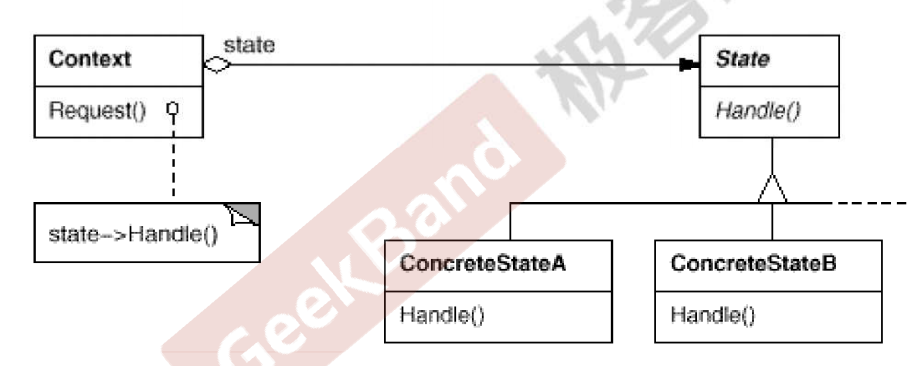
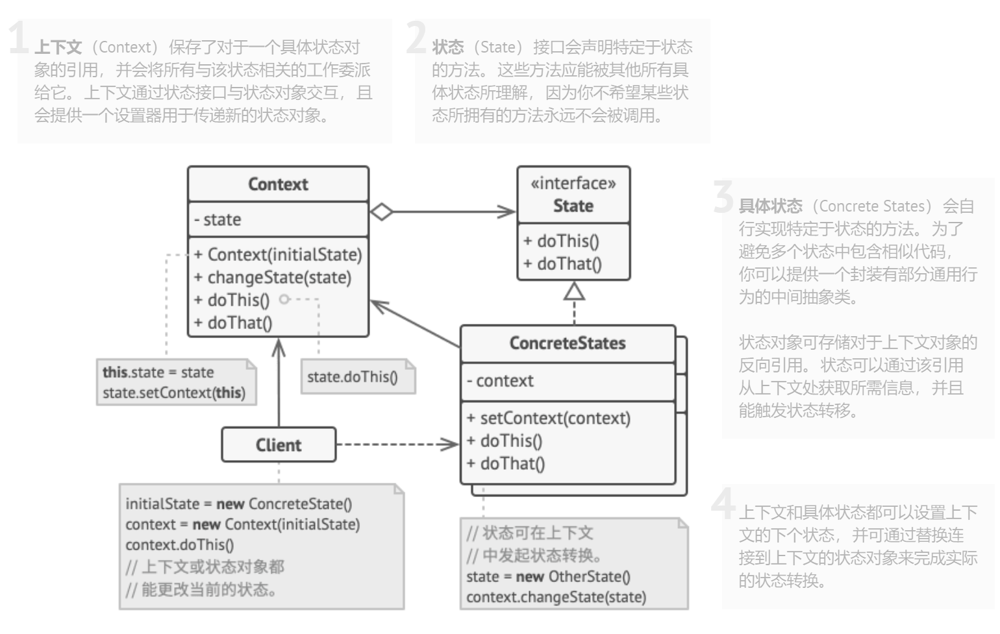
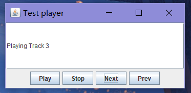
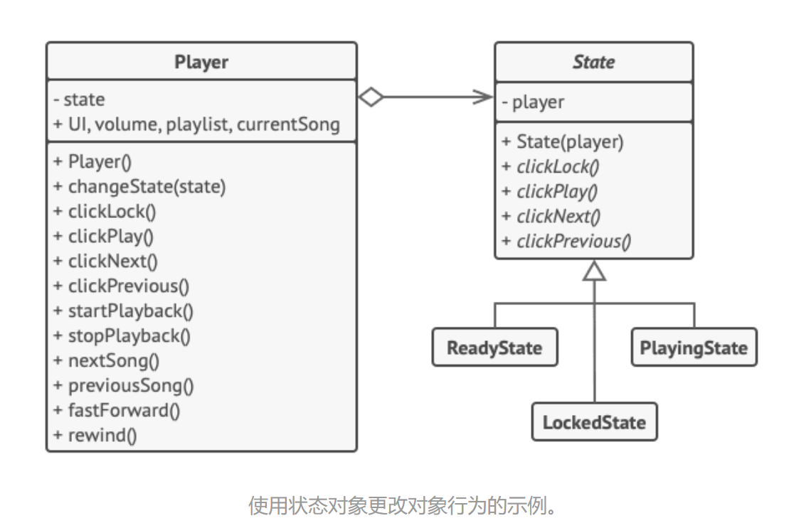

## Chapter 18 State（状态模式）
> **状态变化模式**  
> 在组件构建过程中，某些对象的状态经常面临变化，如何对这些变化进行有效的管理？同时又维持高层模块的稳定？“状态变化”模式为这一问题提供了一种解决方案。  
> 典型模式  
> • **State**  
> • Memento  

### 18.1 Motivation  
* 在软件构建过程中，某些对象的状态如果改变，其行为也会随之而发生变化。比如文档处于只读状态，其支持的行为和读写状态支持的行为就可能完全不同。  
  <br>  
* 如何在运行时根据对象的状态来透明地更改对象的行为？而不会为对象操作和状态转化之间引入紧耦合？  

### 18.2 Definition  
> 允许一个对象在其内部状态改变时改变它的行为。从而使对象看起来似乎修改了其行为。——《设计模式》 GoF  


### 18.3 Structure  
* 《设计模式》GoF  
  
* From Reference  
  

### 18.4 Course points   
* State 模式将所有与一个特定状态相关的行为都放入一个 State 的子类对象中，在对象状态切换时，切换相应的对象；但同时维持 State 的接口，这样实现了具体操作与状态转换之间的解耦。  
  <br>  
* 为不同的状态引入不同的对象使得状态转换变得更加明确，而且可以保证不会出现状态不一致的情况，因为转换是原子性的——即要么彻底转换过来，要么不转换。  
  <br>  
* 如果 State 对象没有实例变量，那么各个上下文可以共享一个 State 对象，从而节省对象开销。  

### 18.5 Application scenarios  
* **如果对象需要根据自身当前状态进行不同行为，同时状态的数量非常多且与状态相关的代码会频繁变更的话，可使用状态模式**。  
  * 模式建议你将所有特定于状态的代码抽取到一组独立的类中。这样一来，你可以在独立于其他状态的情况下添加新状态或修改已有状态，从而减少维护成本。  
  <br>  
* **如果某个类需要根据成员变量的当前值改变自身行为，从而需要使用大量的条件语句时，可使用该模式。**  
  * 状态模式会将这些条件语句的分支抽取到相应状态类的方法中。同时，你还可以清除主要类中与特定状态相关的临时成员变量和帮手方法代码。  
* **当相似状态和基于条件的状态机转换中存在许多重复代码时，可使用状态模式**。  
  * 状态模式让你能够生成状态类层次结构，通过将公用代码抽取到抽象基类中来减少重复。  

### 18.6 Implements way  
* 确定哪些类是上下文。它可能是包含依赖于状态的代码的已有类；如果特定于状态的代码分散在多个类中，那么它可能是一个新的类。  
  <br>  
* 声明状态接口。虽然你可能会需要完全复制上下文中声明的所有方法，但最好是仅**把关注点放在那些可能包含特定于状态的行为的方法上**。  
  <br>  
* 为每个实际状态创建一个继承于状态接口的类。然后检查上下文中的方法并将与特定状态相关的所有代码抽取到新建的类中。在将代码移动到状态类的过程中，你可能会发现它依赖于上下文中的一些私有成员。你可以采用以下几种变通方式：  
  * 将这些成员变量或方法设为公有。  
  * 将需要抽取的上下文行为更改为上下文中的公有方法，然后在状态类中调用。这种方式简陋却便捷，你可以稍后再对其进行修补。  
  * 将状态类嵌套在上下文类中。这种方式需要你所使用的编程语言支持嵌套类。  
  <br>  
* **在上下文类中添加一个状态接口类型的引用成员变量，以及一个用于修改该成员变量值的公有设置器**。  
  <br>  
* 再次检查上下文中的方法，将空的条件语句替换为相应的状态对象方法。  
  <br>  
* 为切换上下文状态，**你需要创建某个状态类实例并将其传递给上下文**。你可以在上下文、各种状态或客户端中完成这项工作。无论在何处完成这项工作，该类都将依赖于其所实例化的具体类。  

### 18.7 Advantages and Disadvantages  
#### 18.7.1 Advantages  
* 单一职责原则。将与特定状态相关的代码放在单独的类中。  
* 开闭原则。无需修改已有状态类和上下文就能引入新状态。  
* 通过消除臃肿的状态机条件语句简化上下文代码。  

#### 18.7.2 Disadvantages  
* 如果状态机只有很少的几个状态，或者很少发生改变，那么应用该模式可能会显得小题大作。  

### 18.8 Relationship with other Patterns  
* **桥接模式**、**状态模式**和**策略模式** （在某种程度上包括适配器模式） 模式的接口非常相似。实际上，它们都基于**组合模式**——即将工作委派给其他对象，不过也各自解决了不同的问题。模式并不只是以特定方式组织代码的配方，你还可以使用它们来和其他开发者讨论模式所解决的问题。  
  <br>  
* **状态模式**可被视为**策略模式**的扩展。两者都基于组合机制：它们都通过将部分工作委派给 “帮手” 对象来改变其在不同情景下的行为。**策略使得这些对象相互之间完全独立，它们不知道其他对象的存在。但状态模式没有限制具体状态之间的依赖，且允许它们自行改变在不同情景下的状态**。

### 18.9 Example  
#### 18.9.1 案例描述  
> 在本例中，状态模式允许媒体播放器根据当前的回放状态进行不同的控制行为。播放器主类包含一个指向状态对象的引用，它将完成播放器的绝大部分工作。某些行为可能会用一个状态对象替换另一个状态对象，改变播放器对用户交互的回应方式。  

#### 18.9.2 before
* 在状态转换时，根据if-else 来判断（和策略模式面临的问题非常类似），违背“**开闭原则**”  
  <br>  
  ```java
    public class Player{
        // ... 其他操作
        public void changeState(String flag){
            if(flag == "ready"){
                // ...
            }
            else if(flag == "locked"){
                // ...
            }
            else{
                // ...
            }
        }

        // ... 其他操作
    }
  ```

#### 18.9.3 after   
* 采用这种方式是有前提的：**所有状态类都必须遵循同样的接口**，而且**上下文必须仅通过接口与这些对象进行交互**。  
  <br>  
* 定义通用状态接口  
  <br>  
  ```java
    /**
    * 所有状态通用接口
    */
    public abstract class State {
        protected Player player;

        /**
        * 上下文对象通过 Stae 构造器传入，方便状态获取有用的上下文信息（这也是和 Strategy 的区别）
        */
        public State(Player player) {
            this.player = player;
        }

        protected abstract String onLock();
        protected abstract String onPlay();
        protected abstract String onNext();
        protected abstract String onPrevious();
    }
  ```  
* 定义具体状态（具体方法的逻辑随状态改变，**也可以增加自己的特有状态**）  
  <br>  
  ```java
    public class ReadyState extends State{
        
        //传入上下文对象的引用，以方便修改状态，或者获取上下文信息（区别于策略模式）
        public ReadyState(Player player) { 
            super(player);
        }

        @Override
        protected String onLock() {
            player.changeState(new LockedState(player));;
            return "Locked...";
        }

        @Override
        protected String onPlay() {
            String action = player.startPlayBack(); // 返回当前放的歌曲
            player.changeState(new PlayingState(player));

            return action;
        }

        @Override
        protected String onNext() {
            return "Locked...";
        }

        @Override
        protected String onPrevious() {
            return "Locked...";
        }
        // 潜在的其他特有状态..
        public otherMethodOfReadyState(){

        }
    }
  ```  
* 定义上下文  
  <br>  
  ```java 
    public class Player {
        private State state; //持有所有状态的引用
        private boolean playing = false;
        private List<String> playList = new ArrayList<>();
        private int currentTrack = 0;

        // 播放器的主要对象总是会连接到一个负责播放器绝大部分工作的状态对象中。
        public Player() {
            // 播放器刚启动，默认为准备播放状态
            this.state = new ReadyState(this);
            setPlaying(true);
            for(int i = 1; i <= 12; ++i){
                playList.add("Track " + i);
            }
        }

        // 提供一个改变播放器状态的共有方法，在其他状态中可以通过上下文调用该方法，从而改变状态
        public void changeState(State state){
            this.state = state;
        }

        public State getState(){
            return state;
        }

        public void setPlaying(boolean playing){
            this.playing = playing;
        }

        public boolean isPlaying(){
            return playing;
        }

        // 开始播放
        public String startPlayBack(){
            return "Play " + playList.get(currentTrack);
        }

        public String nextTrack(){
            currentTrack++;
            // 下一首歌曲索引大于列表长度时，播放第一首,否则播放下一首
            if(currentTrack > playList.size()-1){
                currentTrack = 0;
            }
            return "Playing " + playList.get(currentTrack);
        }

        public String previousTrack(){
            currentTrack--;
            if(currentTrack < 0){
                currentTrack = playList.size()-1;
            }
            return "Playing " + playList.get(currentTrack);
        }

        // 重置歌曲索引
        public void setCurrentTrackAfterStop() {
            this.currentTrack = 0;
        }
    }
  ```  
* 客户端使用 UI   
  <br>  
  ```java
    public class Application {
        public static void main(String[] args) {
            Player player = new Player();
            UI ui = new UI(player);
            ui.init();
        }
    }
  ```  
  
* 在本例中，状态模式将根据当前回放状态，让媒体播放器中的相同控件完成不同的行为。  
  
  <br>  

* 在状态模式中，**特定状态知道其他所有状态的存在，且能触发从一个状态到另一个状态的转换；策略则几乎完全不知道其他策略的存在**。  
  <br>  
### 18.10 Reference 
* [Class.forName()与xxx.class的区别](https://blog.csdn.net/Terminator2015/article/details/52123388)
* [Java 匿名内部类调用局部变量](https://blog.csdn.net/HeatDeath/article/details/79963628)
* [State](https://refactoringguru.cn/design-patterns/state)