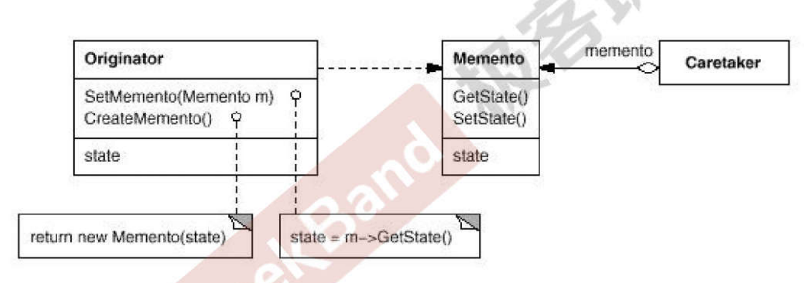
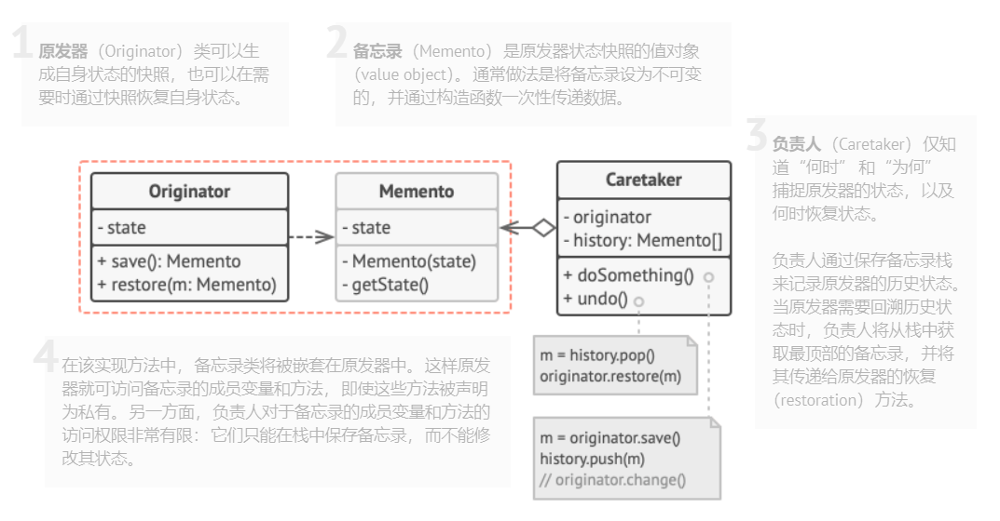
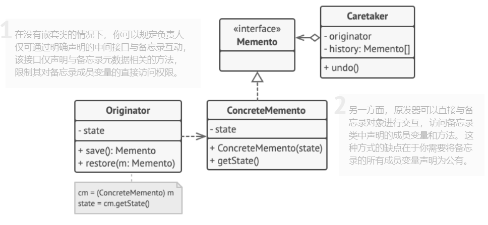
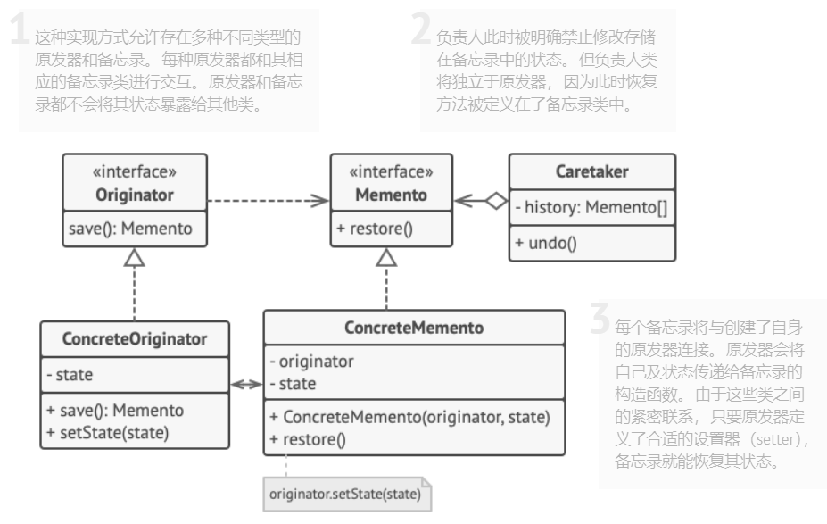

## Chapter 19 Memento（备忘录模式）
> **状态变化模式**  
> 在组件构建过程中，某些对象的状态经常面临变化，如何对这些变化进行有效的管理？同时又维持高层模块的稳定？“状态变化”模式为这一问题提供了一种解决方案。  
> 典型模式  
> • State  
> • **Memento**  

### 19.1 Motivation 
* 在软件构建过程中，某些对象的状态在转换过程中，可能由于某种需要，要求程序能够回溯到对象之前处于某个点时的状态。如果使用一些公有接口来让其它对象得到对象的状态，便会暴露对象的实现细节。  
  <br>  
* 如何实现对象状态的良好保存与恢复？但同时又不会因此而破坏对象本身的封装性。  

### 19.2 Definition  
> 在不破坏封装性的前提下，捕获一个对象的内部状态，并在该对象之外保存这个状态。这样以后就可以将该对象恢复到原先保存的状态。 ——《设计模式》 GoF  

### 19.3 Structure  
  

### 19.4 Course points  
* 备忘录(Memento)存储原发器(Originator)对象的内部状态，在需要时恢复原发器状态。  
  <br>  
* Memento 模式的核心是信息隐藏，即Originator 需要向外界隐藏信息，保持其封装性。但同时又需要将状态保持到外界 (Memento)。  
  <br>  
* 由于现代语言（C# 、Java）运行时都具有相当的对象序列化支持，因此往往采用效率较高、又较容易正确实现的序列化方案来实现 Memento 模式。  
  <br>  
* 模式建议将对象状态的副本存储在一个名为备忘录 （Memento）的特殊对象中。**除了创建备忘录的对象外，任何对象都不能访问备忘录的内容**。其他对象必须使用受限接口与备忘录进行交互，它们可以获取快照的元数据（创建时间和操作名称等），但不能获取快照中原始对象的状态。  
  <br>  
* Memento 模式现在看来有些过时了  

### 19.5 Application scenarios  
*  **当你需要创建对象状态快照来恢复其之前的状态时，可以使用备忘录模式**。  
   * 备忘录模式允许你复制对象中的全部状态（包括私有成员变量），并将其独立于对象进行保存。尽管大部分人因为 “撤销” 这个用例才记得该模式，但其实它在处理事务（比如需要在出现错误时回滚一个操作）的过程中也必不可少。   
    <br>   
* **当直接访问对象的成员变量、获取器或设置器将导致封装被突破时，可以使用该模式**  
  * 备忘录让**对象自行负责创建其状态的快照**。任何其他对象都不能读取快照，这有效地保障了数据的安全性。  

### 19.6 Implements way  
* **确定担任原发器角色的类**。重要的是明确程序使用的一个原发器中心对象，还是多个较小的对象。  
  <br>  
* **创建备忘录类**。逐一声明对应每个原发器成员变量的备忘录成员变量。  
  <br>  
* **将备忘录类设为不可变**。备忘录只能通过构造函数一次性接收数据。该类中不能包含设置器。  
  <br>  
* 如果你所使用的编程语言支持嵌套类，则可将备忘录嵌套在原发器中；如果不支持，那么你可从备忘录类中抽取一个空接口， 然后让其他所有对象通过接口来引用备忘录。你可在该接口中添加一些**元数据操作，但不能暴露原发器的状态**。  
  <br>  
* **在原发器中添加一个创建备忘录的方法**。原发器必须通过备忘录构造函数的一个或多个实际参数来将自身状态传递给备忘录。该方法返回结果的类型必须是你在上一步中抽取的接口（如果你已经抽取了）。实际上，创建备忘录的方法必须直接与备忘录类进行交互。  
  <br>  
* **在原发器类中添加一个用于恢复自身状态的方法**。该方法接受备忘录对象作为参数。如果你在之前的步骤中抽取了接口，那么可将接口作为参数的类型。在这种情况下，你需要将输入对象强制转换为备忘录，因为原发器需要拥有对该对象的完全访问权限。  
  <br>  
* 无论负责人是命令对象、历史记录或其他完全不同的东西，它都必须要知道何时向原发器请求新的备忘录、如何存储备忘录以及何时使用特定备忘录来对原发器进行恢复。  
  <br>  
* **负责人与原发器之间的连接可以移动到备忘录类中**。 **恢复方法也可以移动到备忘录类中**，但只有当备忘录类嵌套在原发器中，或者原发器类作为参数传入备忘录。  
  
### 19.7 Advantages and Disadvantages  
#### 19.7.1 Advantages  
* 你可以在不破坏对象封装情况的前提下创建对象状态快照。  
  <br>  
* 你可以通过让负责人维护原发器状态历史记录来简化原发器代码。  

#### 19.7.2 Disadvantages  
* 如果客户端过于频繁地创建备忘录，程序将消耗大量内存。  
  <br>  
*  负责人必须完整跟踪原发器的生命周期，这样才能销毁弃用的备忘录。  
  <br>   
* 绝大部分动态编程语言（例如 PHP、 Python 和 JavaScript）不能确保备忘录中的状态不被修改。  

### 19.8 Relationship with other Patterns  
* 你可以同时使用**命令模式**和**备忘录模式**来实现 “撤销”。在这种情况下，命令用于对目标对象执行各种不同的操作， 备忘录用来保存一条命令执行前该对象的状态。  
  <br>  
* 你可以同时使用**备忘录**和**迭代器模式**来获取当前迭代器的状态，并且在需要的时候进行回滚。  
  <br>  
* 有时候**原型模式**可以作为**备忘录**的一个简化版本，其条件是你需要在历史记录中存储的对象的状态比较简单，不需要链接其他外部资源，或者链接可以方便地重建。  

### 19.9 Example  
#### 19.9.1 案例描述  
> 使用Java 序列化的方式创建快照   

#### 19.9.2 Memento 架构  
* **基于嵌套类实现**  
  > 该模式的经典实现方式依赖于许多流行编程语言 （例如 C++、 C# 和 Java） 所支持的嵌套类。  

    

* **基于中间接口的实现**  
  > 另外一种实现方法适用于不支持嵌套类的编程语言 （没错， 我说的就是 PHP）。  

      

* **封装更加严格的实现**  
  > 如果你不想让其他类有任何机会通过备忘录来访问原发器的状态， 那么还有另一种可用的实现方式。  

    

#### 19.9.3 example1  
> 下面是基于“**封装更严格的实现**”的弱化版（没有写接口）
* 定义原发器，主要实现快照创建（createSnapshot()）和恢复快照（restore(String state)）  
  <br>  
  ```java
    /**
      *  基于序列化方式实现快照
      *  用待保存的对象的字节流对当前状态进行编码 : Base64.getEncoder().encodeToString(baos.toByteArray())
      *  把编码结果作为当前的 state，然后采用反序列化的方式实现 restore()
      */
      public class Originator{
          // 需要保存的状态
          List<UserInfo> userInfoList = new ArrayList<>();
          // .. 其他可能需要被保存的状态

          public Originator() {
              // ...
          }

          // create snapshot
          public Memento createSnapshot() {
              try {
                  ByteArrayOutputStream baos = new ByteArrayOutputStream();
                  ObjectOutputStream oos = new ObjectOutputStream(baos);
                  oos.writeObject(this.userInfoList);
                  oos.close();
                  String state = Base64.getEncoder().encodeToString(baos.toByteArray()); // 保存状态

                  return new Memento(state,this);

              } catch (IOException e) {
                  return null;
              }
          }

          public void restore(String state) {
              try {
                  byte[] data = Base64.getDecoder().decode(state);
                  ObjectInputStream ois = new ObjectInputStream(new ByteArrayInputStream(data));
                  this.userInfoList = (ArrayList) ois.readObject();
                  ois.close();
              } catch (ClassNotFoundException e) {
                  System.out.print("ClassNotFoundException occurred.");
              } catch (IOException e) {
                  System.out.print("IOException occurred.");
              }
          }
      }
  ```  
* 定义Memento  
  <br>  
  ```java
    /**
      * 保存原发器对象，和快照 state
      */
      public class Memento {
          String state;
          Originator originator;

          public Memento(String state,Originator originator) {
              this.state = state;
              this.originator = originator;
          }

          public void restore(){
              originator.restore(state);
          }
      }
  ```  
* **负责人对象可以是原发器本身**，也可以另外定义，用于保存历史快照（栈）,获取备忘录的元数据信息（创建时间和操作名称等）  
  <br>  
  ```java
    /**
      * 负责人对象
      */
      public class Command {
          private Stack<Memento> history = new Stack<>();

          public void execute(Memento memento){
              history.push(memento);
          }

          public boolean undo(){
              if(!history.isEmpty()){
                  history.peek().restore();
                  history.pop();
                  return true;
              }
              else return false;
           } 
      }
  ```  

#### 19.9.4 example2
* 这是一个比较完整的例子，采用可视化的方式展现了Memento模式在（编辑器，画布等应用）撤销操作上的用途   

### 19.10 Reference  
* [Memento](https://refactoringguru.cn/design-patterns/memento)


