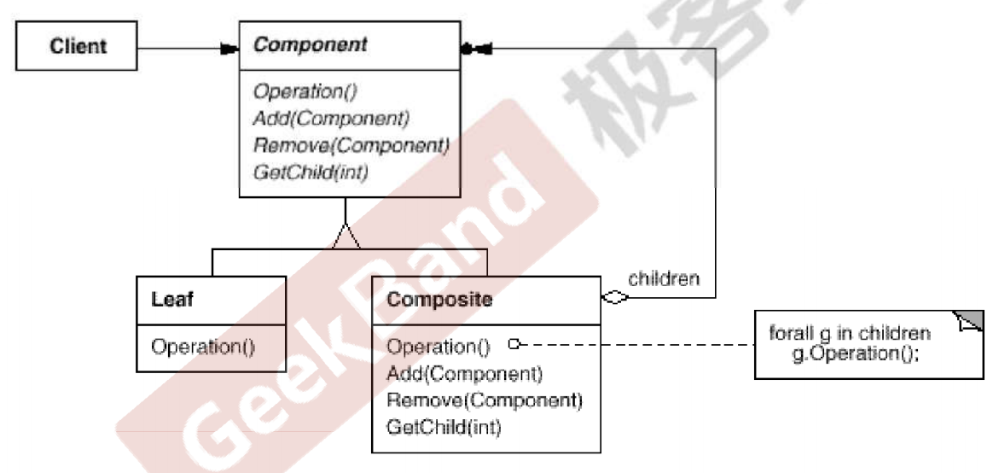
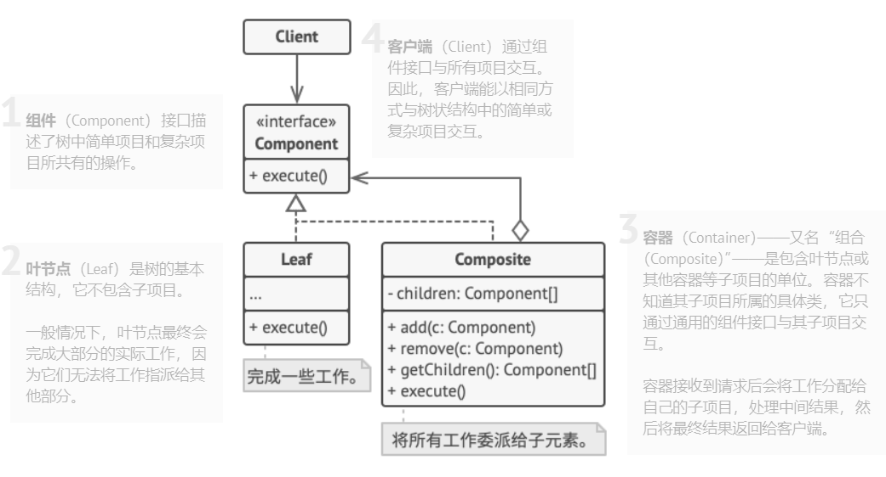

[TOC]  
## Chapter 20 Composite (组合模式)  
> **“数据结构”模式**  
> 常常有一些组件在内部具有特定的数据结构，如果让客户程序依赖这些特定的数据结构，将极大地破坏组件的复用。这时候，将这些特定的数据结构封装在内部，在外部提供统一的接口，来实现与特定数据结构无关的访问，是一种行之有效的解决方案。  
> 典型模式  
> • Composite  
> • Iterator  
> Chain of Responsibility  

### 20.1 Motivation  
* 在某些情况下，客户代码过多地依赖于对象容器的复杂的内部实现结构，对象容器内部实现结构（而非抽象接口）的变化将引起客户代码的频繁变化，带了了代码的维护性、扩展性方面的弊端。  
  <br>   
* 如何将“客户代码与复杂的对象容器结构”解耦？让对象容器自己来实现自身的复杂结构，从而使得客户代码就像处理简单对象一样来处理复杂的对象容器？  

### 20.2 Definition  
> 将对象组合成树形结构以表示“部分-整体”的层次结构。Composite 使得用户对单个对象和组合对象的使用具有一致性（稳定）。 ——《设计模式》 GoF

### 20.3 Structure  
* 《设计模式》GoF  
    

* From Reference   
    

### 20.4 Course points  
* Composite 模式采用树形结构来实现普遍存在的对象容器，从而将“一对多”的关系转化为“一对一”的关系，使得客户代码可以一致地（复用）处理对象和对象容器，无需关心处理的是单个的对象，还是组合的对象容器。  
  <br>  
* 将“客户代码与复杂的对象容器结构”解耦是 Composite 的核心思想，解耦之后，客户代码将与纯粹的抽象接口（而非对象容器内部实现结构）发生依赖，从而更能“应对变化”。  
  <br>  
* Composite 模式在具体实现中，可以让父对象中的子对象反向追溯；如果父对象有频繁的遍历需求，可使用缓存技巧来改善效率。  

### 20.5 Application scenarios  
* **如果你需要实现树状对象结构，可以使用组合模式**  
  * 组合模式为你提供了两种共享公共接口的基本元素类型：简单叶节点和复杂容器。容器中可以包含叶节点和其他容器。这使得你可以构建树状嵌套递归对象结构。   
  <br>   
* **如果你希望客户端代码以相同方式处理简单对象和复杂对象，可以使用该模式**  
  * 组合模式中定义的所有元素共用同一个接口。在这一接口的帮助下，客户端不必在意其所使用的对象的具体类  
  <br>  

### 20.6 Implements way  
* **确保应用的核心模型能够以树状结构表示**。尝试将其分解为简单元素和容器。记住，容器必须能够同时包含简单元素和其他容器。  
  <br>  
* 声明组件接口及其一系列方法，这些方法对简单和复杂元素都有意义。  
  <br>   
* **创建一个叶节点类表示简单元素**。程序中可以有多个不同的叶节点类。   
  <br>   
* **创建一个容器类表示复杂元素**。在该类中，创建一个数组成员变量来存储对于其子元素的引用。该数组必须能够同时保存叶节点和容器，因此请**确保将其声明为组合接口类型**。  
  <br>   
* 实现组件接口方法时， 记住容器应该将大部分工作交给其子元素来完成。   
  <br>   
* 最后， 在容器中定义添加和删除子元素的方法。  
  > 记住，这些操作可在组件接口中声明。这将会违反**接口隔离原则**， 因为叶节点类中的这些方法为空。但是，这可以让客户端无差别地访问所有元素，即使是组成树状结构的元素。   
  <br>  

### 20.7 Advantages and Disadvantages  
#### 20.7.1 Advantages  
* 你可以利用多态和递归机制更方便地使用复杂树结构。    
  <br>  
* 开闭原则。无需更改现有代码，你就可以在应用中添加新元素，使其成为对象树的一部分。  

#### 20.7.2 Disadvantages  
* 对于功能差异较大的类，提供公共接口或许会有困难。在特定情况下，你需要过度一般化组件接口，使其变得令人难以理解。  

### 20.8 Relationship with other Patterns  
* **桥接模式**、**状态模式**和**策略模式** （在某种程度上包括适配器模式）模式的接口非常相似。实际上，它们都基于组合模式——即将工作委派给其他对象，不过也各自解决了不同的问题。模式并不只是以特定方式组织代码的配方，你还可以使用它们来和其他开发者讨论模式所解决的问题。  
  <br>  
* 你可以在创建复杂**组合**树时使用**生成器模式**，因为这可使其构造步骤以递归的方式运行。  
  <br>  
* **责任链模式**通常和**组合模式**结合使用。在这种情况下，叶组件接收到请求后，可以将请求沿包含全体父组件的链一直传递至对象树的底部。  
  <br>  
* 你可以使用**迭代器模式**来遍历**组合**树。  
  <br>  
* 你可以使用**访问者模式**对整个**组合**树执行操作。  
  <br>  
* 你可以使用**享元模式**实现**组合**树的共享叶节点以节省内存。  
  <br>  
* **组合**和**装饰模式**的结构图很相似，因为两者都依赖递归组合来组织无限数量的对象。  
  <br>  
* 大量使用**组合**和**装饰**的设计通常可从对于**原型模式**的使用中获益。你可以通过该模式来复制复杂结构，而非从零开始重新构造。  

### 20.9 Example  
#### 20.9.1 案例描述  
> 例如， 你有两类对象： 产品和盒子 。一个盒子中可以包含多个产品或者几个较小的 盒子 。这些小盒子中同样可以包含一些产品或更小的 盒子 ，以此类推。假设你希望在这些类的基础上开发一个定购系统。订单中可以包含无包装的简单产品，也可以包含装满产品的盒子……以及其他盒子。此时你会如何计算每张订单的总价格呢？   

#### 20.9.2 before  
* 这种实现方式，客户代码过多地依赖于对象容器的复杂的内部实现结构   
  <br>   
  ```java
    public class Client {

      public static void main(String[] args) {
          Composite root = new Composite("root");
          Composite treeNode1 = new Composite("treeNode1");
          Composite treeNode2 = new Composite("treeNode2");
          Composite treeNode3 = new Composite("treeNode3");
          Leaf leaf1 = new Leaf("leaf1");
          Leaf leaf2 = new Leaf("leaf2");
          root.add(treeNode1);
          treeNode1.add(treeNode2);
          treeNode2.add(leaf1);

          root.add(treeNode3);
          treeNode3.add(leaf2);
      }

      /**
      * 这种处理方式，把对象和对象容器复杂数据结构处理过程和客户代码 invoke 耦合到一起，不利于扩展
      */
      public void invoke(Component component){
          if(component instanceof Leaf){
              // 针对叶节点进行处理
          }
          else if(component instanceof Composite){
              for(Component c: ((Composite) component).components){
                  invoke(c);
              }
          }
      }
  }
  ```

#### 20.9.3 after  
> Leaf 对应案例描述的产品，Composite 对应案例描述的盒子  

* 把对对象和对象容器的复杂操作封装在对象容器内部（使用容器实现），对外提供一致的接口  
  <br>  
  ```java
    public interface Component {
        void execute();
    }
  ```  
* 对象容器（Composite）和对象（Leaf）实现具体的操作逻辑（封装在对象和容器内部，对Client不可见）  
  <br>   
  ```java
    /**
      * 把对象或者对象容器统使用 execute() 方法进行了统一
      * 组合会以特定的方式执行其主要逻辑。它会递归遍历所有子项目，并收集和
      * 汇总其结果。由于组合的子项目也会将调用传递给自己的子项目，以此类推，
      * 最后组合将会完成整个对象树的遍历工作。
      *
      * 该方式的最大优点在于你无需了解构成树状结构的对象的具体类。 你也无需了
      * 解对象是简单的Leaf还是复杂的节点组合(Composite)。你只需调用通用接口以相同的方式对其
      * 进行处理即可。当你调用该方法后，对象会将请求沿着树结构传递下去。
      */

      public class Composite implements Component{
          String name;
          // 当前节点的子节点（也是Component类型，可以是Composite或者Leaf）
          // 表达了一种树形结构
          List<Component> components = new ArrayList<>();

          public Composite(String name) {
              this.name = name;
          }

          /**
          * execute 实际上是把对象和对象容器的复杂数据结构操作封装起来了，以便于对用户提供统一的接口
          */
          @Override
          public void execute() {
              //1. 处理当前节点（针对对象容器本身（Composite）的操作）
              // ...

              //2. 处理当前节点的子节点
              // 如果子节点是 Leaf ，则调用 Leaf 的 execute 方法
              // 如果子节点是 Composite ，则调用Composite的 execute ，递归执行
              for(Component c : components){
                  c.execute(); // 多态调用， c 可以是 Leaf 也可以是 Composite
              }
              // ...
          }

          public void add(Component c){
              // ...
          }

          public void remove(Component c){
              // ...
          }
      }
  ```
* Leaf 节点（对应案例描述中的产品）  
  <br>  
  ```java
    public class Leaf implements Component{
        String name;

        public Leaf(String name) {
            this.name = name;
        }

        @Override
        public void execute() {
            // ...
        }
    }
  ```  
* 这样用户就可以通过一致的接口处理产品（Leaf）和盒子（Composite）了  
  <br>  
  ```java
      // 对客户来说，无论是 Leaf 还是 Composite 还是各种组合，都提供了统一的调用接口 invoke
      public void invoke(Component component){
          component.execute();
      }
  ```
### 20.10 Reference  
* [Composite](https://refactoringguru.cn/design-patterns/composite)