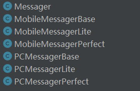

## Chapter 7 Bridge
> 在软件组件的设计中，如果责任划分的不清晰，使用继承得到的结果往往是随着需求的变化，子类急剧膨胀，同时充斥着重复代码，这时候的关键是划清责任。
> 典型模式:
> • Decorator
> • Bridge

### 7.1 Motivation
* 由于某些类型的固有的实现逻辑，使得它们具有两个变化的维度，乃至多个维度的变化。

    <br>

* 如何应对这种“多维度的变化”？如何利用面向对象技术来使得类型可以轻松地沿着两个乃至多个方向变化，而不引入额外的复杂度？

### 7.2 Definition
> 将抽象部分(业务功能)与实现部分(平台实现)分离，使它们都可以独立地变化。 —— 《设计模式》GoF

### 7.3 Structure


###  7.4 Course points
* Bridge模式使用“对象间的组合关系”解耦了抽象和实现之间固 有的绑定关系，使得抽象和实现可以沿着各自的维度来变化。所谓抽象和实现沿着各自纬度的变化，即“子类化”它们。

<br>

* Bridge模式有时候类似于多继承方案，但是多继承方案往往违背单一职责原则（即一个类只有一个变化的原因），复用性比较差。Bridge模式是比多继承方案更好的解决方法。

<br>

* Bridge模式的应用一般在“两个非常强的变化维度”，有时一个 类也有多于两个的变化维度，这时可以使用Bridge的扩展模式。


### 7.5 Example

#### 7.5.1 案例描述
> 公司要开发一个通信系统，具体情况如下：
> 主类Messager:包括与平台无关的login(),sendMessage(),sendPicture()方法，以及需要根据平台（PC,Mobile）变化的 playSound(),drawShape(),writeText()，connect() 等方法
> Messager 需要根据业务类型区分为 Lite 版本 和 Perfect 版本


```java
    public class Messager {
        //平台无关(稳定)
        public void login(String username,String password){};
        public void sendMessage(String message){};
        public void sendPicture(Image image){};

        // 与平台相关（变化）
        public void playSound(){};
        public void drawShape(){};
        public void writeText(){};
        public void connect(){};
    }

```
#### 7.5.2 before
* 定义的类如下:  


  

* 这种方法试图把 PC 和 Mobile 拆分为两个平台来实现，这样似乎也可以。但是有个问题是类太多，代码冗余度高，**破坏“单一职责”原则**如果继续扩大业务，或者跨平台数，那么会有“类爆炸”风险。
      <br>

* **仔细观察代码会发现，MobileMessagerLite 和 PCMessagerLite 代码相似的非常高，MobileMessagerPerfect 和PCMessagerLite相似的非常高,他们都是因为实现平台不同导致的。此时我们应该能够想到把通过化继承为组合的方式，重新定义一个平台的基类（接口），把这个基类（接口）作为Lite 和 Perfect 业务类的成员，使用多态机制，在运行时，动态绑定运行平台（PC,Mobile），这样无论后面扩展多少个平台版本，都可以只写一个Lite 和 Perfect。**

#### 7.5.3 after
* 寻找变化点，把变化的和稳定的隔离开
  > **这里不能用Java interface代替抽象类**，因为Java interface 只能包含 public static final 类型变量，而这里需要持有实现层（Imp）的引用，所有不可以使用接口。
    ```java
        // 每个业务都需要的部分，稳定的（不同业务可以在此类上扩展）
        public abstract class Messager {
            // 持有实现类 MessagerImp （基类）的引用，可以在运行时动态绑定具体平台实现类
            protected MessagerImp messagerImp;

            // 定义构造函数，在子类中调用（抽象函数不能被实例化，但是可以被子类通过super调用）
            public Messager(MessagerImp messagerImp) {
                this.messagerImp = messagerImp;
            }

            public abstract void login(String username, String password);
            public abstract void sendMessage(String message);
            public abstract void sendPicture(Image image);
        }

        // 具体平台的实现，是变化的（也可以通过扩展实现更多功能）
        public abstract class MessagerImp {
            protected abstract void playSound();
            protected abstract void drawShape();
            protected abstract void writeText();
            protected abstract void connect();
        }
    ```  

* 定义的类图  

  

* 类UML图


### 7.6 Reference

* [Java 接口与抽象类区别](https://zhuanlan.zhihu.com/p/94770324)
 