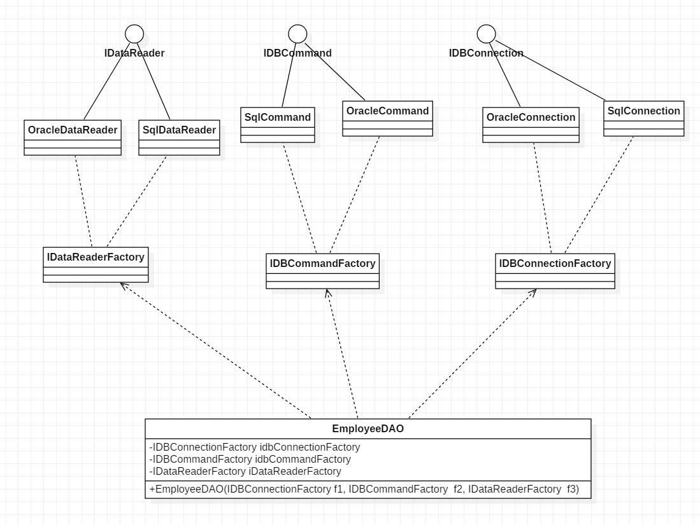

## Chapter 9 Abstract Factory
> 通过“对象创建” 模式绕开new，来避免对象创建（new）过程中所导致的紧耦合（依赖具体类），从而支持对象创建的稳定。它是接口抽象之后的第一步工作。  
> 典型模式    
> • Factory Method  
> • Abstract Factory  
> • Prototype  
> • Builder  


### 9.1 Motivation
* 在软件系统中，经常面临着“一系列相互依赖的对象”的创建工作；同时，由于需求的变化，往往存在更多系列对象的创建工作。

    <br>

* 如何应对这种变化？如何绕过常规的对象创建方法(new)，提供一种“封装机制”来避免客户程序和这种“多系列具体对象创建工作”的紧耦合？


### 9.2 Definition
> 提供一个接口，让该接口负责创建一系列“相关或者相互依赖的对象”，无需指定它们具体的类。 ——《设计模式》 GoF


### 9.3 Structure

  

### 9.4 Course points

* 如果没有应对“多系列对象构建”的需求变化，则没有必要使用Abstract Factory模式，这时候使用简单的工厂完全可以。

<br>

* “系列对象”指的是在某一特定系列下的对象之间有相互依赖、或作用的关系。不同系列的对象之间不能相互依赖。

<br>  

* Abstract Factory模式主要在于应对“新系列”的需求变动。其缺点在于难以应对“新对象”的需求变动。


### 9.5 Example
#### 9.5.1 案例概述
> 现有个任务，写一个数据访问层（EmployeeDAO），需要创建一系列对象（如Sql Server 需要 SqlConnection、SqlCommand、SqlDataReader等），当数据库连接由Sql Server 需要变化为 Oracle 数据库或者其他数据库时，怎么能尽可能的少改变现有代码？   

#### 9.5.2 before
* 下面是最初的设计代码，这种设计最大的问题是：目前连接的是 Sql Server 数据库，如果希望更换数据库，如Oracle,需要修改下面的很多代码包括 Connection、Command、DataReader等部分  


    ```java
        public class EmployeeDAO {
            public List<EmployeeDO> getEmployees(){
                List<EmployeeDO> list = new ArrayList<>();

                //数据库连接操作
                SqlConnection connection = new SqlConnection();
                SqlCommand command = new SqlCommand();
                SqlDataReader reader = new SqlDataReader();

                // 数据操作
                // ...
                return list;
            }
        }
    ```
#### 9.5.3 middle
* 以下这种方式是刚学完 Factory Method 很自然想到的方法：把 Connection、Command、DataReader 分别使用工厂创建这种方法解决静态绑定的问题，可以方便的把sql server改为Oracle但是这种方法存在一个很严重的问题：这三个组件需要保持一致性，即要么都使用Sql server 要么都使用 Oracle，很显然，这种设计不能爆保证上述一致性。    

    <br>

* 核心变化   
     <br>

    ```java
    public class EmployeeDAO {
        private IDBConnectionFactory idbConnectionFactory;
        private IDBCommandFactory idbCommandFactory;
        private IDataReaderFactory iDataReaderFactory;

        public EmployeeDAO(IDBConnectionFactory idbConnectionFactory, IDBCommandFactory idbCommandFactory, IDataReaderFactory iDataReaderFactory) {
            this.idbConnectionFactory = idbConnectionFactory;
            this.idbCommandFactory = idbCommandFactory;
            this.iDataReaderFactory = iDataReaderFactory;
        }

        public List<EmployeeDO> getEmployees(){
            List<EmployeeDO> list = new ArrayList<>();

            //数据库连接操作
            IDBConnection connection = idbConnectionFactory.createConnection("sql server");
            IDBCommand command = idbCommandFactory.createCommand("sql server");
            IDataReader reader = iDataReaderFactory.createDataReader("sql server");

            // 数据操作
            // ...
            return list;
        }
    }
    ```

* 类图  

        

* 类 UML 图

    

#### 9.5.4 after 
* 下面是最终的设计方案，把同类型的数据库处理操作绑定在同一个工厂对象下面    

    <br>  

    ```java
        /**
         * 定义一个抽象类，把同一系列操作放到一起
         */
        abstract class IDBFactory {
            protected abstract IDBConnection createDBConnection();
            protected abstract IDBCommand createDBCommand();
            protected abstract IDataReader createDBDataReader();
        }

        // 改变后的EmployeeDAO
        public class EmployeeDAO {
            IDBFactory idbFactory; //具体类型由上层传入

            public EmployeeDAO(IDBFactory idbFactory) {
                this.idbFactory = idbFactory;

            }

            public List<EmployeeDO> getEmployees(){
                List<EmployeeDO> list = new ArrayList<>();

                //数据库连接操作
                IDBConnection connection = idbFactory.createDBConnection();
                IDBCommand command = idbFactory.createDBCommand();
                IDataReader reader = idbFactory.createDBDataReader();

                // 数据操作
                // ...
                return list;
            }
        }
    ```  

* 如果**客户端**仅接触抽象接口，那么谁来创建实际的工厂对象呢？ **一般情况下， 应用程序会在初始化阶段创建具体工厂对象**。而在此之前，**应用程序必须根据配置文件或环境设定选择工厂类别**。如下  


    ```java
        public void run(String type) throws Exception {
            IDBFactory idbFactory;
            if(type.equals("sql server")){
                idbFactory = new SqlDBFactory();
            }
            else if(type.equals("oracle")){
                idbFactory = new OracleDBFactory();
            }
            else {
                throw new Exception("错误！未知的操作系统。");
            }

            EmployeeDAO employeeDAO = new EmployeeDAO(idbFactory);
        }
    ```
* 类图

      

* 类 UML 图

    

### 9.6 Reference  
* [抽象工厂模式](https://refactoringguru.cn/design-patterns/abstract-factory)