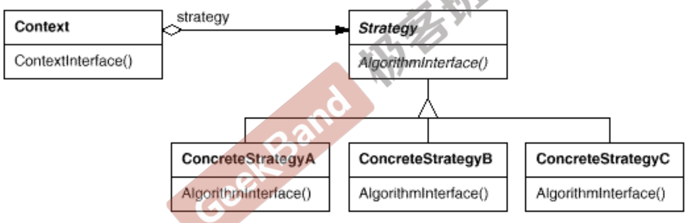

[TOC]

## Chapter 4 Strategy

### 4.1 Motivation
* 在软件构建过程中，某些对象使用的算法可能多种多样，经常改变，如果将这些算法都编码到对象中，将会使对象变得异常复杂；而且有时候支持不使用的算法也是一个性能负担。
    >  if...else 中很多代码并未使用，但是仍然被装载到缓存中，浪费性能
* 如何在运行时根据需要透明地更改对象的算法？将算法与对象本身解耦，从而避免上述问题

### 4.2 Definition
 > 定义一系列算法，把它们一个个封装起来，并且使它们可互相替换（变化）。该模式使得算法可独立于使用它的客户程序(稳定)而变化（扩展，子类化）。  ——《设计模式》 GoF

> Strategy 和 Template Method 有异曲同工之处，并且都属于“组件协作”模式，以扩展的方式支持未来的变化。
### 4.3 Structure

    <br>

> 样例代码中 SalesOrder 对应结构图中的 Context ，Context 持有策略接口的引用。CNTax、USTax、DETax对应 Concrete Strategy,直接继承Stragy 接口即可实现 FRTax 的扩展。

### 4.4 Course points
* Strategy及其子类为组件提供了一系列可重用的算法，从而可以使得类型在运行时方便地根据需要在各个算法之间进行切换。
* Strategy模式提供了用条件判断语句以外的另一种选择，消除条件判断语句，就是在解耦合。含有许多条件判断语句的代码通常都需要Strategy模式
* 如果Strategy对象没有实例变量，那么各个上下文可以共享同一个Strategy对象，从而节省对象开销。
  > 这种情况可以演化为单例模式

### 4.5 Example  
* before : 原始设计
    > 静态的看这个程序，似乎也什么问题，但是程序员应该有时间轴的概念如果客户需要增加其他国家的税收计算，则需要修改这部分源码，这**违背了 “开闭原则”** ==> 对扩展开放，对修改关闭

```java
    public class SalesOrder {
        TaxBase tax;
        public double CalculateTax(){
            double sumTax = 0;
            // ...
            if(tax == TaxBase.CN_Tax){
                // ...
            }
            else if(tax == TaxBase.US_Tax){
                // ...
            }
            else if(tax == TaxBase.DE_Tax){
                // ...
            }
            // ...
            return sumTax;
        }
    }
```

* after ：使用 strategy 模式
    > 可以采用类扩展的方式满足“添加新的国家税费计算”的需求

```java

    // 1、定义用于计算Tax的策略接口
    public interface TaxStrategy {
        double caculate(Parameters parameters);
    }

    // 2、Concrete Strategy （具体策略类）
    // 支持以扩展的方式增加国家
    public class CNTax implements TaxStrategy{
       @Override
        public double caculate(Parameters parameters) {
            return 0;
        }
    }

    // 3、Strategy Context 
    public class SalesOrder {
        TaxStrategy taxStrategy; // 持有策略接口引用，声明为接口类型，而不是具体类

    //    public SalesOrder(TaxStrategy taxStrategy) {
    //        this.taxStrategy = taxStrategy;
    //    }

        // 更好的方法是使用工厂模式创建策略对象
        public SalesOrder(TaxStrategyFactory taxStrategyFactory) {
            this.taxStrategy = taxStrategyFactory.newStrategy();
        }

        // executeStrategy
        public double calculateTax(){
            // ...

            // parameters 不同国家计算税需要的信息,需要根据不同国家而改变，为了程序完整性简单 new了个对象
            double val = taxStrategy.caculate(new Parameters());

            // ...

            return val;
        }
    }

```
* 类UML图  
