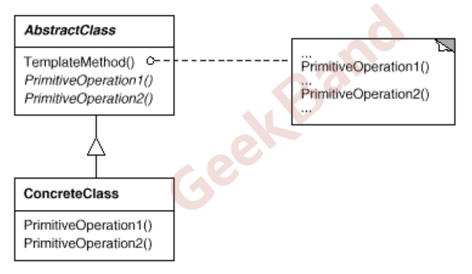
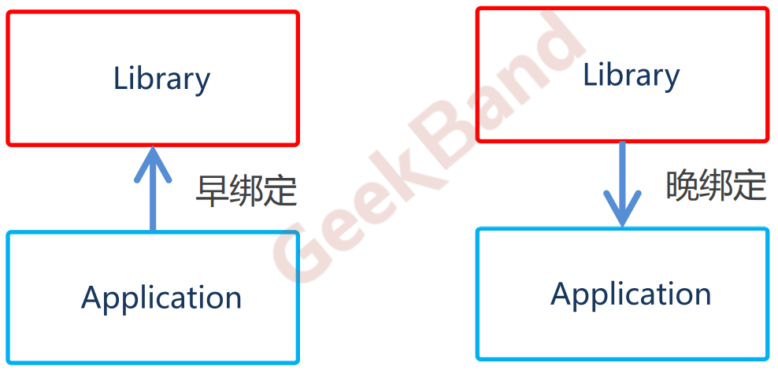

[TOC]

## Chapter 3 Template Method
### 3.1 Definition
> **定义一个操作中的算法的骨架 (稳定)，而将一些步骤延迟(变化)到子类中**。**Template Method使得子类可以不改变
(复用)一个算法的结构即可重定义(override 重写)该算法的某些特定步骤**。

> Key point：_**Template Method 使用的前提条件是算法骨架是稳定的**，当然，如果整个骨架内部逻辑都是稳定的，那么也没必要使用设计模式了，**因为设计模式的最大的作用就是在变化和稳定之间寻找隔离点，然后分离他们，从而管理变化**_。

### 3.2 Motivation
* 在软件构建过程中，对于某一项任务，它常常有稳定的整体操作结构，但各个子步骤却有很多改变的需求，或者由于固有的原因（比如框架与应用之间的关系）而无法和任务的整体结构同时实现。
* 如何在确定稳定操作结构的前提下，来灵活应对各个子步骤的变化或者晚期实现需求？
  


### 3.3 Structure
* TemplateMethod()是稳定的部分，PrimitiveOperation1(), PrimitiveOperation2()是变化的部分（被子类重写）


### 3.5 Course points
* Template Method模式是一种非常基础性的设计模式，在面向对象系统中有着大量的应用。它用最简洁的机制（C++虚函数的多态性以及Java多态）**为很多应用程序框架提供了灵活的扩展点，是代码复用方面的基本实现结构**。
    <br>
* 除了可以灵活应对子步骤的变化外，“**不要调用我，让我来调用你**”（例子中的after/Lib调用after/Application）的反向控制结构是Template Method的典型应用。
    <br>
* 在具体实现方面，被**Template Method调用的可变方法可以具有实现，也可以没有任何实现**（C++抽象方法、C++纯虚方法，Java中不可以声明为抽象方法，因为抽象方法必须把类声明为抽象类），但一般推荐将它们设置为protected（自己与子类可见）方法。


### 3.4 Example
* **没有使用模板方法**
  > 这里为了方便没有自己画图，这里的程序主流程被放到 before/Main.java 里面
  > 这里所说的主流程不是指 main 在什么地方，而是指的是应用程序的核心程序（示例中的 run()方法 ）被直接写在哪里，当然也可能直接写在 main 里面，也就下图这种方法，具体参考代码 before/Application.java 、before/Lib.java。

```java
    /**
    * Lib 由框架开发人员编写，属于稳定类
    * 实现了step1(),step3(),step5()
    */
    public class Lib {

        public void step1(){ // 稳定
            System.out.println(this.getClass().toString() + " step1");
        }
        public void step3(){ // 稳定
            System.out.println(this.getClass().toString() + " step3");
        }
        public void step5(){ // 稳定
            System.out.println(this.getClass().toString() + " step5");
        }
    }

    /**
    * 由应用程序开发人员编写，属于变化类
    * 在 Application中实现 step2(),step4()
    */
    public class Application {
        public boolean step2(){ // 变化
            System.out.println(this.getClass().toString() + " step2");
            return true;
        }
        public void step4(){ // 变化
            System.out.println(this.getClass().toString() + " step4");
        }
    }

    // Main
    public class Main {
        public static void main(String[] args) {
            Lib lib = new Lib();
            Application application1 = new Application();
            lib.step1();

            if(application1.step2()){
                lib.step3();
            }

            for(int i = 0; i < 4; ++i){
                application1.step4();
            }
            lib.step5();
        }
    }

```


<br>
<br>

* **使用模板方法**
  > 把程序核心方法 run()嵌入在框架类 (after/Lib) 中，其中包括了子类需要实现的方法。客户端应用程序只需要重写这些需要改变的方法就行。具体参考 after/Application、after/Lib。这种实现使得**子类可以直接复用父类的代码，并且在需要改变的时候支持修改**。

```java
    /**
    * Lib 由框架开发人员编写，属于稳定类
    * 实现了step1(),step3(),step5()
    */

    public class Lib {

        public void step1(){ // 稳定
            System.out.println(this.getClass().toString() + " step1");
        }

        public void step3(){ // 稳定
            System.out.println(this.getClass().toString() + " step3");
        }

        public void step5(){ // 稳定
            System.out.println(this.getClass().toString() + " step5");
        }

        // step2、step4 类似 C++ 的虚函数，等待子类重写
        public boolean step2(){ // 变化
            return false;
        }

        public void step4(){ // 变化

        }

        /**
        *  template method （run体现）
        *  揭示了绝大部分设计模式的 “稳定中有变化”的特点
        *  Template method 使用前提是 run必须稳定
        */
        public void run(){
            step1();

            if(step2()){ // 支持变化 ，java 多态
                step3();
            }

            for(int i = 0; i < 4; ++i){
                step4(); // 支持变化， java 多态
            }
            step5();
        }
    }

    /**
    * 由应用程序开发人员编写，属于变化类
    * 在 Application中实现 step2(),step4()
    */
    public class Application extends Lib {
        @Override
        public boolean step2(){ // 变化
            System.out.println(this.getClass().toString() + " step2");
            return true;
        }

        @Override
        public void step4(){ // 变化
            System.out.println(this.getClass().toString() + " step4");
        }
    }

    // Main
    public class Main {
      public static void main(String[] args) {
          /**
          * 声明为 Lib ，实际指向 Application,即父类引用指向子类对象
          * 运行时调用 Application2 的重写方法和 Lib中的未被重写的方法
          * 体现多态
          */
          Lib lib = new Application();
          lib.run();
      }
  }
```


<br>
<br>

* **两种实现思路对比**
  > 左侧为未使用模板方法，右侧为使用模板方法




### 3.5 Reference
* [C++ 虚函数与 Java 抽象函数区别](https://blog.csdn.net/yangliuy/article/details/7172228)
  > Java默认的函数就是C++的虚函数类型，可以直接使用多态
* [Java 接口中 default 方法及其使用限制](https://blog.csdn.net/ziwang_/article/details/78680446)
